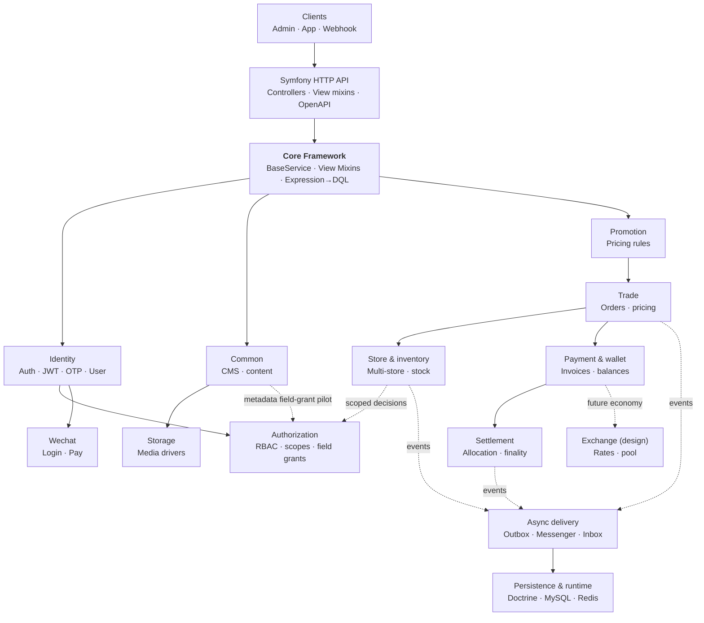
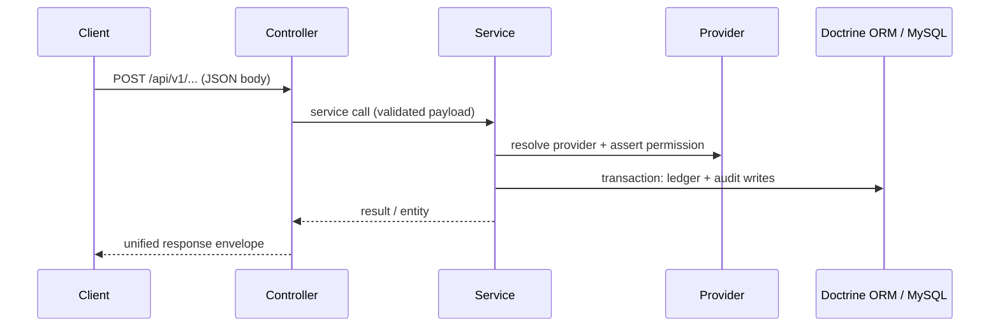
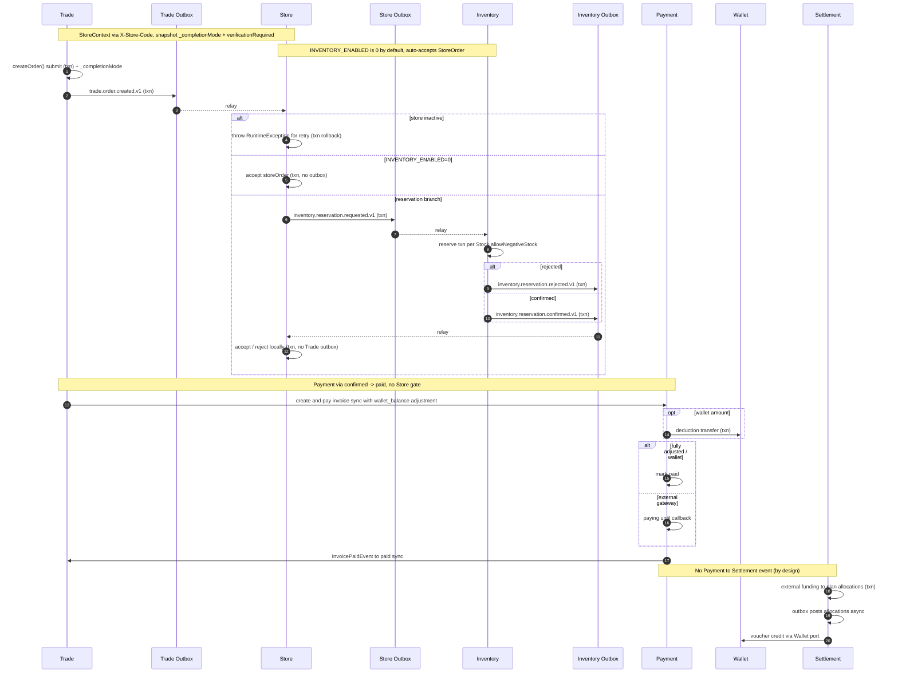

# CRUD Skeleton

A Symfony 8.1 backend foundation for modular CRUD and transaction-heavy APIs. It pairs reusable API conventions with composable business modules and operational safeguards, without requiring every application to adopt every module.

> Chinese (Simplified): [README.zh-cn.md](README.zh-cn.md) · Chinese (Traditional): [README.zh-hant.md](README.zh-hant.md) · Japanese: [README.ja.md](README.ja.md)

> Documentation site: [GitHub Pages](https://immane.github.io/crud-skeleton) | Development manual: [docs/manual/index.md](docs/manual/index.md) | Architecture: [docs/design/system-architecture.md](docs/design/system-architecture.md)

> **Production status**: Inventory (`INVENTORY_ENABLED`) is preview-only and must stay `0` outside isolated dev/test; health checks, rate limiting, and metrics are implemented (rate-limit cache is per-process filesystem — use Redis for multi-worker). See `docs/ai/context.md` §22–24 and `docs/testing/crud-skeleton-production/PRODUCTION_VALIDATION.md`; known defects in `docs/issues/coverage-2026-08-09/README.md`.

## Architecture

The application is a layered Symfony API: controllers compose trait-based view mixins over `BaseService` (CRUD + dynamic query), services own business rules, and Doctrine ORM persists to MySQL. It is a modular monolith whose modules collaborate through explicit service and event boundaries within one Symfony application.



Business operations follow a consistent request-to-transaction boundary. For example,
a wallet payment resolves its provider in the service layer and records its effects in
one database transaction:



### Commerce Orchestration

Order fulfilment crosses synchronous transaction boundaries and asynchronous event
delivery. Store verification is gated by `Store.settings.fulfillment.requireVerification`
(default `false`) and completion is snapshotted per order (`_completionMode`);
inventory reservation is gated by `INVENTORY_ENABLED` (default `0` = disabled).
Settlement is intentionally shown separately: it begins with externally confirmed
funding, not with an implemented Payment-to-Settlement event.



## Table of Contents

- [Architecture](#architecture)
- [Quick Start Guide](#quick-start-guide)
- [Why This Project](#why-this-project)
- [Included Capabilities](#included-capabilities)
- [Module Overview](#module-overview)
- [Create Your Own CRUD Module](#create-your-own-crud-module)
- [Documentation](#documentation)
- [Testing](#testing)
- [Docker Deployment](#docker-deployment)
- [Contributing](#contributing)
- [License](#license)

## Quick Start Guide

For a minimal runnable setup (JWT keys, DB migration, admin user, login/auth test), see [QUICKSTART.md](QUICKSTART.md).

If you are on macOS, commands in the quick start prefer Homebrew PHP (`/opt/homebrew/bin/php`) to avoid CLI version mismatch.

## Why This Project

CRUD Skeleton is for applications that need more than generated CRUD but do not need a
distributed system on day one. It keeps routine API work consistent while providing
clear extension points for domain-specific behavior.

- **Reusable API foundation**: shared services, controller mixins, validation, serialization, and expression-driven queries reduce repetitive endpoint code.
- **Composable business domains**: commerce, inventory, payments, wallets, settlement, identity, storage, and promotion are organised around explicit service and event boundaries.
- **Operationally ready defaults**: Docker Compose, asynchronous workers, outbox processing, health checks, metrics, rate limits, and CI quality gates are included rather than left as integration work.

## Included Capabilities

- **Consistent CRUD APIs**: shared service behavior, controller composition, and dynamic filtering, sorting, projection, and expansion.
- **Transactional commerce workflows**: orders, inventory reservations, invoices, payment gateways, wallet adjustments, and settlement allocation.
- **Financial auditability**: idempotent transfers, voucher-backed deposits and withdrawals, internal balance verification and reconciliation, and versioned settlement rules.
- **Extensible integrations**: JWT and OTP authentication, WeChat login and payment, local or Qiniu media storage, and a promotion-rule DSL.
- **Access control and audit**: `ROLE_ADMIN`-protected management endpoints plus an independent **Authorization** module (scoped RBAC `global|store`, portable `UNIQUE(user,role,scope_type,scope_key)`, strict field grants, append-only audit, `AuthorizationVoter`). Permission catalogue is seeded and read-only; Content `metadata` field-grant pilot (`common:content:metadata`, no `store_uuid`) is enforced via `FieldAuthorizationService`; `Assignment.scopeKey` is internal (`scopeUuid ?? ''`) with `getScopeKey()`/`syncScopeKey()` lifecycle, no public setter.
- **Reliable asynchronous processing**: Messenger workers and an outbox/inbox pattern for cross-module events.
- **Production diagnostics**: OpenAPI documentation, readiness and liveness probes, Prometheus metrics, and endpoint rate limiting.
- **Enforced quality checks**: PHPUnit, PHPStan Level 8, Rector type rules, and a 90% line-coverage threshold in CI.

## Tech Stack

| Component | Technology |
|-----------|-----------|
| Language | PHP `>= 8.4` |
| Framework | Symfony `8.1.*` |
| ORM | Doctrine ORM `^3.6` |
| Database | MySQL 8 (Docker/prod) / SQLite (local tests) / PostgreSQL 16 (CI tests) |
| Auth | JWT (RS256) + OTP (SMS) |
| API Docs | NelmioApiDocBundle (OpenAPI 3) |
| Testing | PHPUnit `^12.5` (+ paratest for parallel runs) |
| Static analysis | PHPStan Level 8 + Rector type rules |
| Frontend | [crud-admin](https://github.com/immane/crud-admin) — configuration-driven admin panel |
| Docs | MkDocs Material (GitHub Pages) |

See `composer.json` for the full dependency list.

## Project Structure

The repository is a modular monolith: `src/` holds the application code (Core framework
plus business modules such as Common, Identity, Trade (orders via Store catalog), Store (catalog, membership, StoreOrder), Payment, Wallet, Storage, Authorization, and more),
alongside `config/`, `migrations/`, `tests/`, `docs/`, and the Docker/Compose files.
See [Authorization Setup](docs/manual/authorization.md) for how to seed and operate Authorization.

For the full, detailed directory tree (down to controllers, services, entities, and
repositories for every module), see
**[Project Structure — Development Manual](docs/manual/project-structure.md)**.

## Getting Started

For native and Docker setup alternatives, JWT configuration, first-run verification, and
troubleshooting, see **[Getting Started — Development Manual](docs/manual/getting-started.md)**.

Docker development works without creating an env file. For native PHP/Symfony, create
local overrides in `.env.local` (see [Configuration](#configuration)).

## Configuration

For the full environment file reference — file roles, every variable, complete
`.env.local` / `.env.prod.local` examples, and secret generation — see
**[Deployment — Development Manual](docs/manual/deployment.md)**.

Environment file roles at a glance:

| File | Purpose | Commit? |
|------|---------|---------|
| `.env` | Committed Symfony defaults, no secrets | Yes |
| `.env.dev`, `.env.test` | Committed environment defaults for dev/test | Yes |
| `.env.local`, `.env.*.local` | Machine-local overrides and secrets | No |
| `.env.example` | Local development variable reference | Yes |
| `.env.prod.example` | Production Docker template | Yes |
| `.env.prod.local` | Real production Docker values | No |

For production, do not store secrets in committed files. Use real environment variables or a local production env file.

### Media Storage and Qiniu

Media upload supports multiple storage drivers through a unified media storage interface
(`local` built in, `qiniu` optional). The default driver is set via an environment
variable, and you can override it per upload with a multipart form field named `storage`.

For the full reference — installing the Qiniu SDK, configuring the Qiniu credentials,
and enabling the driver — see
**[Media Storage & Qiniu — Development Manual](docs/manual/storage.md)**.

## Run Locally

For the full setup walkthrough (Docker and native PHP, JWT keys, verification,
troubleshooting), see **[Getting Started — Development Manual](docs/manual/getting-started.md)**.

You can run the app natively with PHP/Symfony, or with Docker Compose (app, nginx,
MySQL, Redis, Mailpit). The app runs on the configured local port.

## Module Overview

| Module | Purpose | Key Features |
|--------|---------|--------------|
| **Core** | API foundation | REST controller support, shared service behavior, view mixins, expression queries |
| **Common** | CMS and settings | Categories, tags, content, media, pages, comments, and key-value settings |
| **Trade** | Commerce | Orders, order workflow and price calculation over Store catalog via `CatalogResolver` (scalar `specificationUuid` snapshots) |
| **Store** | Multi-store operations | Store membership, reliable order-event handoff and Product/Specification catalog (global `store = NULL` and store-private) |
| **Inventory** | Stock control | Per-store stock, reservations, recipes, and stock ledger policies |
| **Payment** | Invoice orchestration | Invoice lifecycle, gateway abstraction, payment adjustments, webhooks |
| **Wallet** | Balance operations | Transfers, deposits, withdrawals, vouchers, and reconciliation |
| **Settlement** | Allocation and finality | Versioned rules, auditable allocations, and wallet posting |
| **Promotion** | Pricing rules | Promotion DSL, calculation strategies, and campaign routing |
| **Identity** | Authentication | JWT, OTP, registration, user profiles, and administration |
| **Authorization** | Authorization | Scoped RBAC (`global`/`store`), Store-scoped grants, strict field grants, audit log, cache-backed `AuthorizationService` |
| **Storage** | Media uploads | Local and Qiniu Kodo storage drivers |
| **Wechat** | WeChat integration | Login and WeChat Pay V3 |
| **Exchange** *(design)* | Points economy | Exchange-rate and liquidity-pool design; not implemented |

Application API endpoints return a unified JSON envelope. Health checks, metrics, and
Swagger/OpenAPI endpoints use their respective formats. For request/response format,
authentication, pagination, and error handling, see
**[API Contracts — Development Manual](docs/manual/api-contracts.md)**.

## How the Service Layer Works

`BaseService` composes focused traits that provide infrastructure access, transactions,
read/list behavior with the dynamic query engine, and mutation behavior
(`new()`/`update()`/`remove()`), while preserving public compatibility through
`BaseServiceInterface`.

For the deep dive, see **[Core Framework — Development Manual](docs/manual/core-framework.md)**
and **[Core Usage — Development Manual](docs/manual/core-usage.md)**.

## Dynamic Query System

The `list()` method supports pagination plus expression-driven filter, sort, order,
select, and expand parameters (compiled to DQL with an in-memory fallback). For the
complete reference, see **[Query System — Development Manual](docs/manual/query-system.md)**.

## Create Your Own CRUD Module

Quick steps: create a Doctrine entity, a `BaseService`-extending service, a repository,
App/Manage controllers using API mixins, register routes, and add a migration.

A minimal controller composes the API view mixins over a service interface:

```php
namespace App\Common\Controller\App;

use App\Common\Service\ContentServiceInterface;
use App\Core\Controller\RestController;
use App\Core\View\ApiView;
use App\Core\View\DetailApiViewMixin;
use App\Core\View\ListApiViewMixin;

class ContentController extends RestController
{
    use ApiView, DetailApiViewMixin, ListApiViewMixin;

    public function __construct(
        protected readonly ContentServiceInterface $service
    ) {}
}
```

See **[Module Design Contract](docs/design/module-design.md)** for the full specification
and **[Core Usage — Development Manual](docs/manual/core-usage.md)** for practical recipes.

## Documentation

- **[Quick Start](QUICKSTART.md)** — Minimal local setup, first migration, and authentication check
- **[Development Manual](docs/manual/index.md)** — Task-oriented guide to setup, architecture, framework usage, testing, and deployment
- **[Architecture & Design Contracts](docs/design/system-architecture.md)** — Module boundaries, API, data-model, and extension contracts
- **[Database & Migrations](docs/manual/database-and-migrations.md)** — Doctrine conventions and portable migration workflow
- **[Integration Events](docs/manual/integration-events.md)** — Transactional outbox/inbox, idempotent consumers, retries, and scheduler operation
- **[Bundle Design Docs](docs/design/bundles/)** — Design notes for implemented and design-stage modules
- **[Authorization Design](docs/design/bundles/authorization.md)** — Independent Authorization module design, migration path, Content pilot, field grants, and acceptance criteria
- **[Runbooks](docs/runbooks/)** — Per-module operational procedures
- **[Testing & Production Validation](docs/testing/crud-skeleton-production/README.md)** — Required validation evidence by change type
- **[OpenAPI Specification](docs/openapi/endpoints.yaml)** and **[Order & Payment Flow](docs/openapi/order-payment-flow.md)** — API reference and consumer workflow
- **Runtime Swagger UI**: `http://localhost:8080/api/doc` while the application is running
- **[Security Hardening](docs/design/security-hardening.md)** and **[Security Policy](SECURITY.md)** — Security controls and responsible disclosure

## Testing

The test suite covers unit, integration, low-value, and smoke layers. CI runs the main
suite with coverage, enforces a 90% line-coverage threshold, and also runs PHPStan
Level 8 and Rector type-rule checks.

For the full test structure, helpers, running tests (serial/parallel/coverage), and CI
coverage details, see **[Testing — Development Manual](docs/manual/testing.md)**.

## Docker Deployment

For the complete deployment reference — every service, all environment variables,
`.env` / `.env.prod.local` setup, JWT keys, health checks, scheduler commands, and
upgrading — see **[Deployment — Development Manual](docs/manual/deployment.md)**.

The stack runs nginx (reverse proxy) in front of PHP-FPM, backed by MySQL and Redis,
with a Messenger worker and an outbox scheduler. Development and production overlays
are provided via Compose files.

## Troubleshooting

Common issues include PHP version mismatches, database connection errors, serialization
problems, and authentication failures. For the full troubleshooting walkthrough, see
**[Getting Started — Development Manual](docs/manual/getting-started.md)**.

## Contributing

Follow the **[Contributing Guide](CONTRIBUTING.md)** for branching, code style, tests,
commit conventions, and pull-request expectations. Keep pull requests focused and add
or update tests for behavior changes. Report vulnerabilities through the
**[Security Policy](SECURITY.md)** rather than a public issue.

## Internationalization (i18n)

The project supports `en`, `zh`, `zh_Hant`, and `ja` via Symfony's Translation
component. Locale is detected automatically from the request, the `Accept-Language`
header, or the default.

For the full i18n reference (adding keys, locale detection, docs translation flow),
see **[Internationalization — Development Manual](docs/manual/i18n.md)**.

Translated READMEs: [README.zh-cn.md](README.zh-cn.md) · [README.zh-hant.md](README.zh-hant.md) · [README.ja.md](README.ja.md)

## License

Apache-2.0. See [LICENSE](LICENSE) for details.
