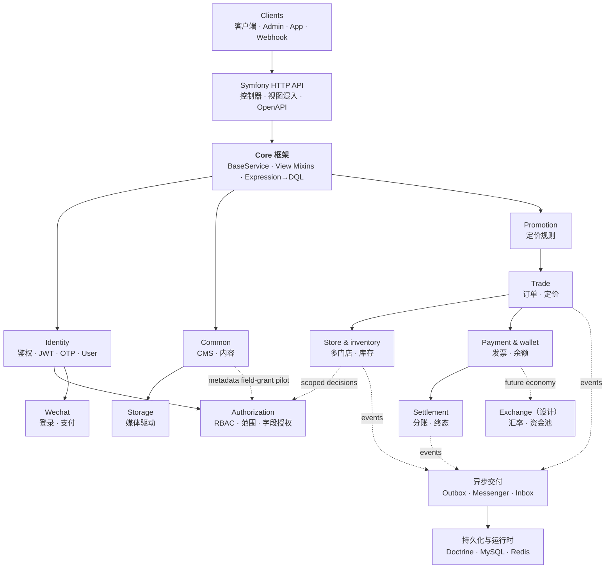
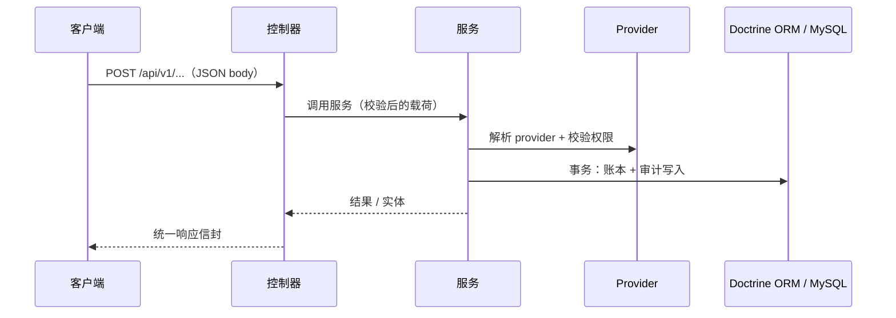
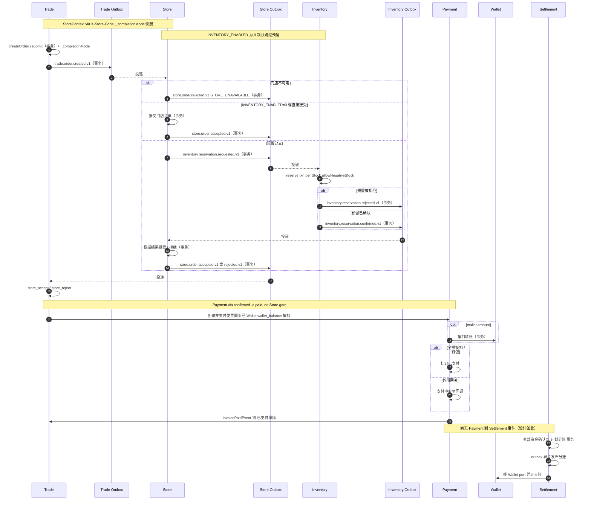

# CRUD Skeleton

一个面向模块化 CRUD 与高事务量 API 的 Symfony 8.1 后端基础。它将可复用的 API 约定、可组合的业务模块与运维保障相结合，而不要求每个应用都采用全部模块。

> English: [README.md](README.md) · Chinese (Traditional): [README.zh-hant.md](README.zh-hant.md) · Japanese: [README.ja.md](README.ja.md)

> 文档站点: [GitHub Pages](https://immane.github.io/crud-skeleton) | 开发手册: [docs/manual/index.md](docs/manual/index.md) | 架构: [docs/design/system-architecture.md](docs/design/system-architecture.md)

> **生产状态**：Inventory（`INVENTORY_ENABLED`）为预览功能，非隔离开发/测试环境必须保持 `0`；健康检查、限流与指标已实现（限流缓存为进程内文件系统——多 worker 请使用 Redis）。参见 `docs/ai/context.md` §22–24 与 `docs/testing/crud-skeleton-production/PRODUCTION_VALIDATION.md`；已知缺陷见 `docs/issues/coverage-2026-08-09/README.md`。

## 架构

应用是分层 Symfony API：控制器基于 trait 组合的视图 mixin 调用 `BaseService`（CRUD + 动态查询），服务承载业务规则，Doctrine ORM 持久化到 MySQL。它是一个模块化单体，各模块在同一个 Symfony 应用内通过显式的服务与事件边界协作。



业务操作遵循一致的“请求到事务”边界。例如，钱包支付在服务层解析其 provider，并在一次数据库事务中记录其效果：



### 电商编排

订单履约会跨越同步事务边界与异步事件投递。门店接受/核销由 `StoreSettings` 控制（默认无需核销——自动接受），库存预留由 `INVENTORY_ENABLED` 控制（默认 `0`=关闭）。结算在图中被刻意独立展示：它由外部确认的资金启动，而不是由尚未实现的 Payment-to-Settlement 事件触发。



## 目录

- [架构](#架构)
- [快速上手指南](#快速上手指南)
- [为什么使用这个项目](#为什么使用这个项目)
- [内置能力](#内置能力)
- [模块概览](#模块概览)
- [如何创建自己的 CRUD 模块](#如何创建自己的-crud-模块)
- [文档说明](#文档说明)
- [测试](#测试)
- [Docker 部署](#docker-部署)
- [贡献指南](#贡献指南)
- [许可证](#许可证)

## 快速上手指南

如果你希望快速跑通本地登录与鉴权（JWT 密钥、数据库迁移、管理员用户、登录/鉴权测试），请直接看 [QUICKSTART.md](QUICKSTART.md)。

在 macOS 下建议优先使用 Homebrew PHP（`/opt/homebrew/bin/php`），避免与系统默认 PHP 版本冲突。

## 为什么使用这个项目

CRUD Skeleton 面向那些需要超越生成式 CRUD、但暂时不需要分布式系统的应用。它让常规 API 工作保持一致，同时为领域特定行为提供清晰的扩展点。

- **可复用的 API 基础**：共享服务、控制器 mixin、校验、序列化与表达式驱动查询，减少重复的端点代码。
- **可组合的业务领域**：电商、库存、支付、钱包、结算、身份、存储与促销围绕显式的服务与事件边界组织。
- **开箱即用的运维默认值**：Docker Compose、异步 worker、outbox 处理、健康检查、指标、限流与 CI 质量门禁均已内置，而非留作集成工作。

## 内置能力

- **一致的 CRUD API**：共享服务行为、控制器组合，以及动态筛选、排序、投影与展开。
- **事务性电商工作流**：订单、库存预留、发票、支付网关、钱包抵扣与结算分账。
- **财务可审计性**：幂等转账、凭证背书的存款与取款、内部余额校验与对账，以及版本化结算规则。
- **可扩展的集成**：JWT 与 OTP 鉴权、微信登录与支付、本地或七牛媒体存储，以及促销规则 DSL。
- **访问控制与审计**：`ROLE_ADMIN` 保护的管理端点，外加独立 **Authorization** 模块（`global|store` 范围化 RBAC、可移植 `UNIQUE(user,role,scope_type,scope_key)`、严格字段授权、追加写审计、`AuthorizationVoter`）。权限目录由 `app:authorization:seed` 种子化且只读；Content `metadata` 字段授权试点（`common:content:metadata`，无 `store_uuid`）经 `FieldAuthorizationService` 强制；`Assignment.scopeKey` 为内部派生列（`scopeUuid ?? ''`，`getScopeKey()`/`syncScopeKey()`，无公开 setter）。
- **可靠的异步处理**：Messenger worker 与跨模块事件的 outbox/inbox 模式。
- **生产诊断**：OpenAPI 文档、就绪与存活探针、Prometheus 指标与端点限流。
- **强制的质量检查**：PHPUnit、PHPStan Level 8、Rector 类型规则，以及 CI 中 90% 的行覆盖率门槛。

## 技术栈

| 组件 | 技术 |
|------|------|
| 语言 | PHP `>= 8.4` |
| 框架 | Symfony `8.1.*` |
| ORM | Doctrine ORM `^3.6` |
| 数据库 | MySQL 8（Docker/生产）/ SQLite（本地测试）/ PostgreSQL 16（CI 测试） |
| 鉴权 | JWT (RS256) + OTP (短信) |
| API 文档 | NelmioApiDocBundle (OpenAPI 3) |
| 测试 | PHPUnit `^12.5`（支持 paratest 并行运行） |
| 静态分析 | PHPStan Level 8 + Rector 类型规则 |
| 前端 | [crud-admin](https://github.com/immane/crud-admin) — 配置驱动的管理后台 |
| 文档 | MkDocs Material (GitHub Pages) |

完整依赖请查看 `composer.json`。

## 项目结构

仓库是一个模块化单体：`src/` 存放应用代码（Core 框架以及 Common、Identity、Authorization、Trade（经 Store 目录的订单）、Store（目录、成员、StoreOrder）、Inventory、Payment、Wallet、Promotion、Storage、Settlement、Exchange 等业务模块），旁边是 `config/`、`migrations/`、`tests/`、`docs/` 以及 Docker/Compose 文件。`src/Authorization/` 的种子化与运维见 [Authorization Setup](docs/manual/authorization.md)。

完整的详细目录树（到每个模块的控制器、服务、实体、仓库层级），请参阅
**[项目结构 — 开发手册](docs/manual/project-structure.md)**。

## 快速开始

本机与 Docker 安装方式、JWT 配置、首次运行验证与故障排查，请参阅 **[快速开始 — 开发手册](docs/manual/getting-started.md)**。

Docker 开发环境无需创建 env 文件即可启动。本机 PHP/Symfony 运行时，请在 `.env.local` 中覆盖本地配置（见 [配置说明](#配置说明)）。

## 配置说明

完整的环境变量参考——文件职责、全部变量、完整的 `.env.local` / `.env.prod.local` 示例、密钥生成——请参阅 **[部署 — 开发手册](docs/manual/deployment.md)**。

环境变量文件职责一览：

| 文件 | 用途 | 是否提交 |
|------|------|----------|
| `.env` | 已提交的 Symfony 默认值，不放密钥 | 是 |
| `.env.dev`、`.env.test` | 已提交的开发/测试默认值 | 是 |
| `.env.local`、`.env.*.local` | 本机覆盖值和密钥 | 否 |
| `.env.example` | 本地开发变量参考 | 是 |
| `.env.prod.example` | 生产 Docker 模板 | 是 |
| `.env.prod.local` | 真实生产 Docker 配置 | 否 |

生产环境请不要在仓库中提交明文密钥。使用真实系统环境变量，或使用本地生产 env 文件。

### 媒体存储与七牛

媒体上传通过统一的媒体存储接口支持多种存储驱动（`local` 内置，`qiniu` 可选）。默认驱动通过环境变量设置，上传时可通过 multipart 表单字段 `storage` 覆盖。

完整参考——安装七牛 SDK、配置七牛凭据、启用驱动——请参阅
**[媒体存储与七牛 — 开发手册](docs/manual/storage.md)**。

## 本地运行

完整的安装步骤（Docker 与本机 PHP、JWT 密钥、验证、故障排查）请参阅 **[快速开始 — 开发手册](docs/manual/getting-started.md)**。

你可以用 PHP/Symfony 本机运行，或用 Docker Compose（app、nginx、MySQL、Redis、Mailpit）运行。应用运行在配置的本地端口上。

## 模块概览

| 模块 | 用途 | 核心特性 |
|------|------|---------|
| **Core** | API 基础 | REST 控制器支持、共享服务行为、视图 mixin、表达式查询 |
| **Common** | CMS 与设置 | 分类、标签、内容、媒体、页面、评论与键值设置 |
| **Trade** | 电商 | 订单、订单工作流与基于 Store 目录的定价（经 `CatalogResolver`，`specificationUuid` 快照） |
| **Store** | 多门店运营 | 门店会员、可靠的订单事件交接与 Product/Specification 目录（`store = NULL` 为全局共享） |
| **Inventory** | 库存控制 | 门店库存、预留、配方与库存台账策略 |
| **Payment** | 发票编排 | 发票生命周期、网关抽象、支付抵扣、Webhook |
| **Wallet** | 余额操作 | 转账、存款、取款、凭证与对账 |
| **Settlement** | 分账与终态 | 版本化规则、可审计分账与钱包入账 |
| **Promotion** | 定价规则 | 促销 DSL、计算策略与活动路由 |
| **Identity** | 鉴权 | JWT、OTP、注册、用户资料与管理 |
| **Authorization** | 授权 | 范围化 RBAC（`global`/`store`）、门店范围授权、严格字段授权、审计日志、基于缓存的 `AuthorizationService` |
| **Storage** | 媒体上传 | 本地与七牛 Kodo 存储驱动 |
| **Wechat** | 微信集成 | 登录与微信支付 V3 |
| **Exchange** *(设计)* | 点数经济 | 汇率与流动性池设计；尚未实现 |

应用 API 端点返回统一的 JSON 信封。健康检查、指标与 Swagger/OpenAPI 端点使用各自格式。请求/响应格式、鉴权、分页与错误处理，请参阅
**[API 契约 — 开发手册](docs/manual/api-contracts.md)**。

## 服务层设计说明

`BaseService` 组合了聚焦的 trait，提供基础设施访问、事务、带动态查询引擎的读/列表行为，以及变更行为（`new()`/`update()`/`remove()`），并通过 `BaseServiceInterface` 保持公共兼容性。

深入讲解请参阅 **[核心框架 — 开发手册](docs/manual/core-framework.md)**
与 **[核心用法 — 开发手册](docs/manual/core-usage.md)**。

## 动态查询系统

`list()` 方法支持分页以及表达式驱动的筛选、排序、排序、字段选择与展开参数（编译为 DQL，并具备内存回退）。完整参考请参阅 **[查询系统 — 开发手册](docs/manual/query-system.md)**。

## 如何创建自己的 CRUD 模块

简要步骤：创建 Doctrine 实体、继承 `BaseService` 的服务、仓库、使用 API mixin 的 App/Manage 控制器、注册路由，并添加迁移。

最小控制器通过服务接口组合 API 视图 mixin：

```php
namespace App\Common\Controller\App;

use App\Common\Service\ContentServiceInterface;
use App\Core\Controller\RestController;
use App\Core\View\ApiView;
use App\Core\View\DetailApiViewMixin;
use App\Core\View\ListApiViewMixin;

class ContentController extends RestController
{
    use ApiView, DetailApiViewMixin, ListApiViewMixin;

    public function __construct(
        protected readonly ContentServiceInterface $service
    ) {}
}
```

完整规范请参阅 **[模块设计契约](docs/design/module-design.md)**，实用配方请参阅 **[核心用法 — 开发手册](docs/manual/core-usage.md)**。

## 文档说明

- **[快速开始](QUICKSTART.md)** — 最小本地安装、首次迁移与鉴权检查
- **[开发手册](docs/manual/index.md)** — 面向任务的安装、架构、框架用法、测试与部署指南
- **[架构与设计契约](docs/design/system-architecture.md)** — 模块边界、API、数据模型与扩展契约
- **[数据库与迁移](docs/manual/database-and-migrations.md)** — Doctrine 约定与可移植迁移工作流
- **[集成事件](docs/manual/integration-events.md)** — 事务性 outbox/inbox、幂等消费者、重试与调度器操作
- **[Bundle 设计文档](docs/design/bundles/)** — 已实现与设计阶段模块的设计说明
- **[Authorization 设计](docs/design/bundles/authorization.md)** — 独立的 Authorization 模块设计、迁移路径、内容试点、字段授权与验收标准
- **[Runbooks 运维手册](docs/runbooks/)** — 各模块的操作流程
- **[测试与生产验证](docs/testing/crud-skeleton-production/README.md)** — 按变更类型要求的验证证据
- **[OpenAPI 规范](docs/openapi/endpoints.yaml)** 与 **[订单与支付流程](docs/openapi/order-payment-flow.md)** — API 参考与消费方工作流
- **运行时 Swagger UI**：应用运行时访问 `http://localhost:8080/api/doc`
- **[安全加固](docs/design/security-hardening.md)** 与 **[安全策略](SECURITY.md)** — 安全控制与负责任披露

## 测试

测试套件覆盖单元、集成、低价值与冒烟层。CI 运行主套件并带覆盖率，强制 90% 的行覆盖率门槛，同时运行 PHPStan Level 8 与 Rector 类型规则检查。

完整的测试结构、helper、运行方式（串行/并行/覆盖率）与 CI 覆盖率细节，请参阅 **[测试 — 开发手册](docs/manual/testing.md)**。

## Docker 部署

完整的部署参考——每个服务、全部环境变量、`.env` / `.env.prod.local` 配置、JWT 密钥、健康检查、调度命令与升级——请参阅 **[部署 — 开发手册](docs/manual/deployment.md)**。

技术栈在 nginx（反向代理）之后运行 PHP-FPM，由 MySQL 与 Redis 支撑，并带有 Messenger worker 与 outbox 调度器。开发与生产覆盖通过 Compose 文件提供。

## 常见问题

常见问题包括 PHP 版本不匹配、数据库连接错误、序列化问题与鉴权失败。完整的故障排查请参阅 **[快速开始 — 开发手册](docs/manual/getting-started.md)**。

## 贡献指南

请遵循 **[贡献指南](CONTRIBUTING.md)** 了解分支、代码风格、测试、提交约定与 PR 期望。保持 PR 小而聚焦，行为变化请补充或更新测试。发现漏洞请通过 **[安全策略](SECURITY.md)** 报告，而非公开 issue。

## 国际化（i18n）

项目通过 Symfony Translation 组件支持 `en`、`zh`、`zh_Hant` 与 `ja`。语言根据请求、`Accept-Language` 请求头或默认值自动检测。

完整的 i18n 参考（添加键、语言检测、文档翻译流程）请参阅 **[国际化 — 开发手册](docs/manual/i18n.md)**。

翻译版 README：[README.zh-hant.md](README.zh-hant.md) · [README.ja.md](README.ja.md)

## 许可证

Apache-2.0。详见 [LICENSE](LICENSE)。
