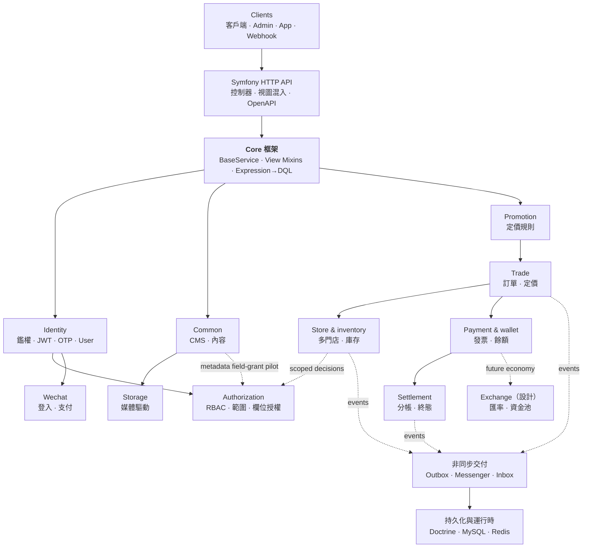
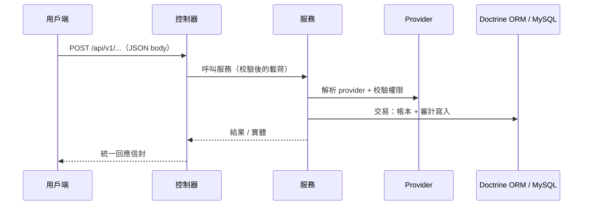
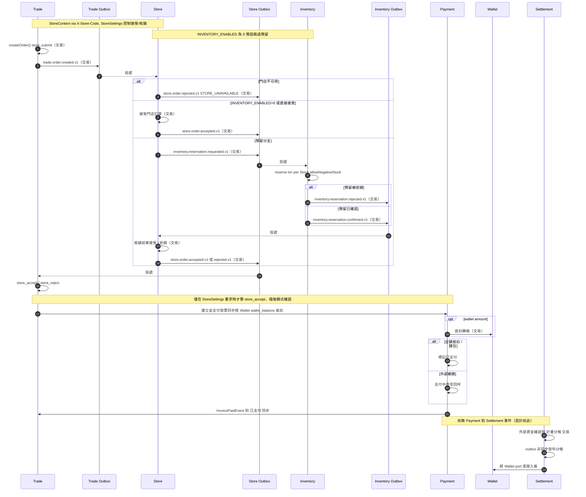

# CRUD Skeleton

一個面向模組化 CRUD 與高交易量 API 的 Symfony 8.1 後端基礎。它將可重用的 API 慣例、可組合的業務模組與營運保障相結合，而不要求每個應用都採用全部模組。

> English: [README.md](README.md) · Chinese (Simplified): [README.zh-cn.md](README.zh-cn.md) · Japanese: [README.ja.md](README.ja.md)

> 文件站點: [GitHub Pages](https://immane.github.io/crud-skeleton) | 開發手冊: [docs/manual/index.md](docs/manual/index.md) | 架構: [docs/design/system-architecture.md](docs/design/system-architecture.md)

> **生產狀態**：Inventory（`INVENTORY_ENABLED`）為預覽功能，非隔離開發/測試環境必須保持 `0`；健康檢查、限流與指標已實作（限流快取為進程內文件系統——多 worker 請使用 Redis）。參見 `docs/ai/context.md` §22–24 與 `docs/testing/crud-skeleton-production/PRODUCTION_VALIDATION.md`；已知缺陷見 `docs/issues/coverage-2026-08-09/README.md`。

## 架構

應用是分層 Symfony API：控制器基於 trait 組合的檢視 mixin 呼叫 `BaseService`（CRUD + 動態查詢），服務承載業務規則，Doctrine ORM 持久化到 MySQL。它是一個模組化單體，各模組在同一個 Symfony 應用內透過顯式的服務與事件邊界協作。



業務操作遵循一致的「請求到交易」邊界。例如，錢包支付在服務層解析其 provider，並在一次資料庫交易中記錄其效果：



### 電商編排

訂單履約會跨越同步交易邊界與非同步事件投遞。門店接受/核銷由 `StoreSettings` 控制（預設無需核銷——自動接受），庫存預留由 `INVENTORY_ENABLED` 控制（預設 `0`=關閉）。結算在圖中被刻意獨立展示：它由外部確認的資金啟動，而不是由尚未實作的 Payment-to-Settlement 事件觸發。



## 目錄

- [架構](#架構)
- [快速上手指南](#快速上手指南)
- [為什麼使用這個專案](#為什麼使用這個專案)
- [內建能力](#內建能力)
- [模組概覽](#模組概覽)
- [如何建立自己的 CRUD 模組](#如何建立自己的-crud-模組)
- [文件說明](#文件說明)
- [測試](#測試)
- [Docker 部署](#docker-部署)
- [貢獻指南](#貢獻指南)
- [許可證](#許可證)

## 快速上手指南

如果你希望快速跑通本機登入與鑑權（JWT 金鑰、資料庫遷移、管理員使用者、登入/鑑權測試），請直接看 [QUICKSTART.md](QUICKSTART.md)。

在 macOS 下建議優先使用 Homebrew PHP（`/opt/homebrew/bin/php`），避免與系統預設 PHP 版本衝突。

## 為什麼使用這個專案

CRUD Skeleton 面向那些需要超越生成式 CRUD、但暫時不需要分散式系統的應用。它讓例行 API 工作保持一致，同時為領域特定行為提供清晰的擴充點。

- **可重用的 API 基礎**：共享服務、控制器 mixin、校驗、序列化與表達式驅動查詢，減少重複的端點程式碼。
- **可組合的業務領域**：電商、庫存、支付、錢包、結算、身份、儲存與促銷圍繞顯式的服務與事件邊界組織。
- **開箱即用的營運預設值**：Docker Compose、非同步 worker、outbox 處理、健康檢查、指標、限流與 CI 品質門禁均已內建，而非留作整合工作。

## 內建能力

- **一致的 CRUD API**：共享服務行為、控制器組合，以及動態篩選、排序、投影與展開。
- **交易性電商工作流**：訂單、庫存預留、發票、支付網關、錢包抵扣與結算分帳。
- **財務可審計性**：冪等轉帳、憑證背書的存款與取款、內部餘額校驗與對帳，以及版本化結算規則。
- **可擴充的整合**：JWT 與 OTP 鑑權、微信登入與支付、本機或七牛媒體儲存，以及促銷規則 DSL。
- **存取控制與審計**：`ROLE_ADMIN` 保護的管理端點，外加獨立 **Authorization** 模組（`global|store` 範圍化 RBAC、可移植 `UNIQUE(user,role,scope_type,scope_key)`、嚴格欄位授權、追加寫審計、`AuthorizationVoter`）。權限目錄由 `app:authorization:seed` 種子化且唯讀；Content `metadata` 欄位授權試點（`common:content:metadata`，無 `store_uuid`）經 `FieldAuthorizationService` 強制；`Assignment.scopeKey` 為內部衍生欄位（`scopeUuid ?? ''`，`getScopeKey()`/`syncScopeKey()`，無公開 setter）。
- **可靠的非同步處理**：Messenger worker 與跨模組事件的 outbox/inbox 模式。
- **生產診斷**：OpenAPI 文件、就緒與存活探針、Prometheus 指標與端點限流。
- **強制的品質檢查**：PHPUnit、PHPStan Level 8、Rector 型別規則，以及 CI 中 90% 的行覆蓋率門檻。

## 技術棧

| 組件 | 技術 |
|------|------|
| 語言 | PHP `>= 8.4` |
| 框架 | Symfony `8.1.*` |
| ORM | Doctrine ORM `^3.6` |
| 資料庫 | MySQL 8（Docker/生產）/ SQLite（本機測試）/ PostgreSQL 16（CI 測試） |
| 鑑權 | JWT (RS256) + OTP (簡訊) |
| API 文件 | NelmioApiDocBundle (OpenAPI 3) |
| 測試 | PHPUnit `^12.5`（支援 paratest 並行） |
| 靜態分析 | PHPStan Level 8 + Rector 型別規則 |
| 前端 | [crud-admin](https://github.com/immane/crud-admin) — 配置驅動的管理後台 |
| 文件 | MkDocs Material (GitHub Pages) |

完整依賴請查看 `composer.json`。

## 專案結構

倉庫是一個模組化單體：`src/` 存放應用程式碼（Core 框架以及 Common、Identity、Authorization、Trade（經 Store 目錄的訂單）、Store（目錄、成員、StoreOrder）、Inventory、Payment、Wallet、Promotion、Storage、Settlement、Exchange 等業務模組），旁邊是 `config/`、`migrations/`、`tests/`、`docs/` 以及 Docker/Compose 檔案。`src/Authorization/` 的種子化與運維見 [Authorization Setup](docs/manual/authorization.md)。

完整的詳細目錄樹（到每個模組的控制器、服務、實體、倉庫層級），請參閱
**[專案結構 — 開發手冊](docs/manual/project-structure.md)**。

## 快速開始

本機與 Docker 安裝方式、JWT 配置、首次執行驗證與故障排除，請參閱 **[快速開始 — 開發手冊](docs/manual/getting-started.md)**。

Docker 開發環境無需建立 env 檔案即可啟動。本機 PHP/Symfony 執行時，請在 `.env.local` 中覆蓋本機配置（見 [配置說明](#配置說明)）。

## 配置說明

完整的環境變數參考——檔案職責、全部變數、完整的 `.env.local` / `.env.prod.local` 範例、金鑰產生——請參閱 **[部署 — 開發手冊](docs/manual/deployment.md)**。

環境變數檔案職責一覽：

| 檔案 | 用途 | 是否提交 |
|------|------|----------|
| `.env` | 已提交的 Symfony 預設值，不放金鑰 | 是 |
| `.env.dev`、`.env.test` | 已提交的開發/測試預設值 | 是 |
| `.env.local`、`.env.*.local` | 本機覆蓋值與金鑰 | 否 |
| `.env.example` | 本機開發變數參考 | 是 |
| `.env.prod.example` | 生產 Docker 範本 | 是 |
| `.env.prod.local` | 真實生產 Docker 配置 | 否 |

生產環境請不要在倉庫中提交明文金鑰。使用真實系統環境變數，或使用本機生產 env 檔案。

### 媒體儲存與七牛

媒體上傳透過統一的媒體儲存介面支援多種儲存驅動（`local` 內建，`qiniu` 可選）。預設驅動透過環境變數設定，上傳時可透過 multipart 表單欄位 `storage` 覆蓋。

完整參考——安裝七牛 SDK、配置七牛憑證、啟用驅動——請參閱
**[媒體儲存與七牛 — 開發手冊](docs/manual/storage.md)**。

## 本機執行

完整的安裝步驟（Docker 與本機 PHP、JWT 金鑰、驗證、故障排除）請參閱 **[快速開始 — 開發手冊](docs/manual/getting-started.md)**。

你可以用 PHP/Symfony 本機執行，或用 Docker Compose（app、nginx、MySQL、Redis、Mailpit）執行。應用執行在配置的本機連接埠上。

## 模組概覽

| 模組 | 用途 | 核心特性 |
|------|------|---------|
| **Core** | API 基礎 | REST 控制器支援、共享服務行為、檢視 mixin、表達式查詢 |
| **Common** | CMS 與設定 | 分類、標籤、內容、媒體、頁面、評論與鍵值設定 |
| **Trade** | 電商 | 訂單、訂單工作流與基於 Store 目錄的定價（經 `CatalogResolver`，`specificationUuid` 快照） |
| **Store** | 多門店營運 | 門店會員、可靠的訂單事件交接與 Product/Specification 目錄（`store = NULL` 為全域共用） |
| **Inventory** | 庫存控制 | 門店庫存、預留、配方與庫存台帳策略 |
| **Payment** | 發票編排 | 發票生命週期、網關抽象、支付抵扣、Webhook |
| **Wallet** | 餘額操作 | 轉帳、存款、取款、憑證與對帳 |
| **Settlement** | 分帳與終態 | 版本化規則、可審計分帳與錢包入帳 |
| **Promotion** | 定價規則 | 促銷 DSL、計算策略與活動路由 |
| **Identity** | 鑑權 | JWT、OTP、註冊、使用者資料與管理 |
| **Authorization** | 授權 | 範圍化 RBAC（`global`/`store`）、門店範圍授權、嚴格欄位授權、審計日誌、基於快取的 `AuthorizationService` |
| **Storage** | 媒體上傳 | 本機與七牛 Kodo 儲存驅動 |
| **Wechat** | 微信整合 | 登入與微信支付 V3 |
| **Exchange** *(設計)* | 點數經濟 | 匯率與流動性池設計；尚未實作 |

應用 API 端點回傳統一的 JSON 信封。健康檢查、指標與 Swagger/OpenAPI 端點使用各自格式。請求/回應格式、鑑權、分頁與錯誤處理，請參閱
**[API 契約 — 開發手冊](docs/manual/api-contracts.md)**。

## 服務層設計說明

`BaseService` 組合了聚焦的 trait，提供基礎設施存取、交易、帶動態查詢引擎的讀/列表行為，以及變更行為（`new()`/`update()`/`remove()`），並透過 `BaseServiceInterface` 保持公共相容性。

深入講解請參閱 **[核心框架 — 開發手冊](docs/manual/core-framework.md)**
與 **[核心用法 — 開發手冊](docs/manual/core-usage.md)**。

## 動態查詢系統

`list()` 方法支援分頁以及表達式驅動的篩選、排序、排序、欄位選擇與展開參數（編譯為 DQL，並具備記憶體回退）。完整參考請參閱 **[查詢系統 — 開發手冊](docs/manual/query-system.md)**。

## 如何建立自己的 CRUD 模組

簡要步驟：建立 Doctrine 實體、繼承 `BaseService` 的服務、倉庫、使用 API mixin 的 App/Manage 控制器、註冊路由，並新增遷移。

最小控制器透過服務介面組合 API 檢視 mixin：

```php
namespace App\Common\Controller\App;

use App\Common\Service\ContentServiceInterface;
use App\Core\Controller\RestController;
use App\Core\View\ApiView;
use App\Core\View\DetailApiViewMixin;
use App\Core\View\ListApiViewMixin;

class ContentController extends RestController
{
    use ApiView, DetailApiViewMixin, ListApiViewMixin;

    public function __construct(
        protected readonly ContentServiceInterface $service
    ) {}
}
```

完整規範請參閱 **[模組設計契約](docs/design/module-design.md)**，實用配方請參閱 **[核心用法 — 開發手冊](docs/manual/core-usage.md)**。

## 文件說明

- **[快速開始](QUICKSTART.md)** — 最小本機安裝、首次遷移與鑑權檢查
- **[開發手冊](docs/manual/index.md)** — 面向任務的安裝、架構、框架用法、測試與部署指南
- **[架構與設計契約](docs/design/system-architecture.md)** — 模組邊界、API、資料模型與擴充契約
- **[資料庫與遷移](docs/manual/database-and-migrations.md)** — Doctrine 慣例與可移植遷移工作流
- **[整合事件](docs/manual/integration-events.md)** — 交易性 outbox/inbox、冪等消費者、重試與排程器操作
- **[Bundle 設計文件](docs/design/bundles/)** — 已實作與設計階段模組的設計說明
- **[Authorization 設計](docs/design/bundles/authorization.md)** — 獨立的 Authorization 模組設計、遷移路徑、內容試點、欄位授權與驗收標準
- **[Runbooks 營運手冊](docs/runbooks/)** — 各模組的操作流程
- **[測試與生產驗證](docs/testing/crud-skeleton-production/README.md)** — 按變更類型要求的驗證證據
- **[OpenAPI 規範](docs/openapi/endpoints.yaml)** 與 **[訂單與支付流程](docs/openapi/order-payment-flow.md)** — API 參考與消費方工作流
- **執行時 Swagger UI**：應用執行時存取 `http://localhost:8080/api/doc`
- **[安全強化](docs/design/security-hardening.md)** 與 **[安全策略](SECURITY.md)** — 安全控制與負責任揭露

## 測試

測試套件涵蓋單元、整合、低價值與冒煙層。CI 執行主套件並帶覆蓋率，強制 90% 的行覆蓋率門檻，同時執行 PHPStan Level 8 與 Rector 型別規則檢查。

完整的測試結構、helper、執行方式（串行/並行/覆蓋率）與 CI 覆蓋率細節，請參閱 **[測試 — 開發手冊](docs/manual/testing.md)**。

## Docker 部署

完整的部署參考——每個服務、全部環境變數、`.env` / `.env.prod.local` 配置、JWT 金鑰、健康檢查、排程命令與升級——請參閱 **[部署 — 開發手冊](docs/manual/deployment.md)**。

技術棧在 nginx（反向代理）之後執行 PHP-FPM，由 MySQL 與 Redis 支撐，並帶有 Messenger worker 與 outbox 排程器。開發與生產覆蓋透過 Compose 檔案提供。

## 常見問題

常見問題包括 PHP 版本不匹配、資料庫連線錯誤、序列化問題與鑑權失敗。完整的故障排除請參閱 **[快速開始 — 開發手冊](docs/manual/getting-started.md)**。

## 貢獻指南

請遵循 **[貢獻指南](CONTRIBUTING.md)** 了解分支、程式碼風格、測試、提交慣例與 PR 期望。保持 PR 小而聚焦，行為變化請補充或更新測試。發現漏洞請透過 **[安全策略](SECURITY.md)** 報告，而非公開 issue。

## 國際化（i18n）

專案透過 Symfony Translation 元件支援 `en`、`zh`、`zh_Hant` 與 `ja`。語言根據請求、`Accept-Language` 請求頭或預設值自動偵測。

完整的 i18n 參考（新增鍵、語言偵測、文件翻譯流程）請參閱 **[國際化 — 開發手冊](docs/manual/i18n.md)**。

翻譯版 README：[README.zh-cn.md](README.zh-cn.md) · [README.ja.md](README.ja.md)

## 許可證

Apache-2.0。詳見 [LICENSE](LICENSE)。
