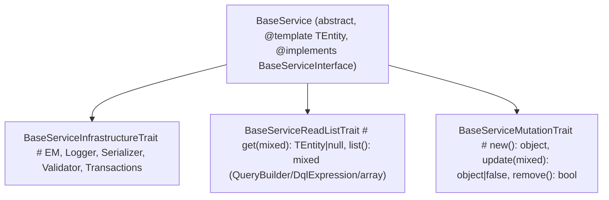
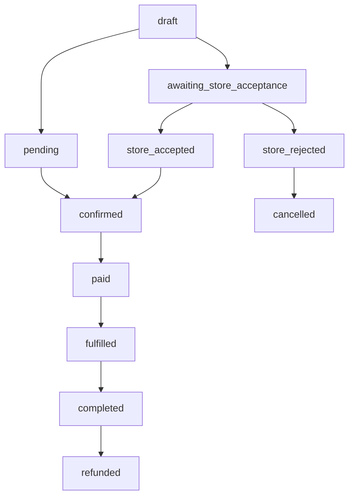
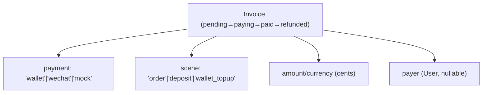
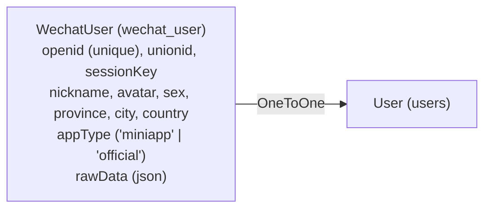

# CRUD Skeleton - Full Codebase Context

> Context snapshot. Last updated: 2026-09-03

---

## 1. Project Overview

**CRUD Skeleton** is a Symfony 8.1 API backend skeleton with:
- **PHP 8.4+**, Doctrine ORM 3.6, MySQL 8 (Docker), SQLite (tests)
- JWT authentication (RS256), OTP/SMS login, WeChat Mini Program / Official Account login
- Expression-based dynamic query engine (`@filter`, `@sort`, `@dql`) + server-owned row-scope `DqlExpression` (`entity.getUser() == this.getUser()`, `in`/`not in` with empty-collection safety)
- Modular architecture: **Core** (framework + DqlExpression), **Common** (CMS + Content `metadata` field-grant pilot), **Authorization** (independent RBAC — scoped Store grants, strict field grants, audit, `AuthorizationVoter`), **Promotion** (DSL-driven promotions), **Identity** (auth), **Trade** (commercial orders), **Store** (multi-store operations and approved shared/private catalog target), **Payment** (invoices), **Wallet** (balances), **Inventory** (stock & reservation), **Wechat** (login + pay), **Storage** (file upload drivers)
- EasyWeChat 6.x integration (Mini Program, Official Account OAuth, WeChat Pay V3)
- NelmioApiDoc (Swagger at `/api/doc`), PHPUnit 12.5, Docker Compose (7 services: app, worker, scheduler, nginx, MySQL, Redis, Mailpit)
- MkDocs Material + GitHub Pages documentation (**mermaid diagram rendering enabled** via CDN + `pymdownx.superfences` custom fence)
- **i18n**: Symfony Translation with en, zh, zh_Hant, ja — all user-facing messages, entity/field names, and status values translated
- **Wallet ledger**: voucher-backed single-sided deposits/withdrawals (`wallet_voucher` boundary ledger) with provider-owned voucher-type permissions; **Exchange** bundle design (pool-backed points economy) at `docs/design/bundles/exchange.md`

## 2. Directory Structure

```text
├── public/index.php              # Front controller
├── public/.htaccess              # Apache rewrite rules + Authorization header forwarding
├── src/Kernel.php                # Symfony Kernel (MicroKernelTrait)
├── bin/console                   # CLI entry point
│
├── src/Core/                     # Framework core
│   ├── Controller/RestController.php    # Base API controller (success/warning/pagination)
│   ├── Controller/System/               # System introspection (EntityController, RouterController)
│   ├── View/                     # PHP traits: List, Detail, Create, Update, Delete, Workflow, Single, Transform + ApiView (commonFilter/DqlExpression binding)
│   ├── View/ApiViewMessages.php         # Extracted message constants for View traits (ENTITY_NOT_FOUND, SUCCESS, INVALID_JSON, propertyRequired(), etc.)
│   ├── Service/BaseService.php          # Abstract CRUD service (@template TEntity generics)
│   ├── Service/Concern/                 # Traits: Infrastructure, ReadList (DqlExpression fail-closed, @filter/@dql), Mutation (@template TEntity)
│   ├── Parser/ExpressionDqlParser.php   # Expression → DQL compiler (NameNode variable binding, in/not in array handling)
│   ├── Query/DqlExpression.php          # Immutable server-owned row-scope value object (expression/values/criteria/this)
│   ├── Serializer/FlatNormalizer.php    # Custom object normalizer (Doctrine internal objects → class names)
│   ├── EventListener/                   # ExceptionInterceptor, ControllerListener, OpenApiEnricherListener, LocaleListener, AccessLogListener
│   └── Utils/                           # UUID, Math, RSA, Location, Inflect, etc.
│
├── src/Common/                   # CMS module: Category, Tag, Content (`metadata` field-grant pilot), Comment, Page, Media, Setting, Picture
│   ├── Entity/                   # 8 entities (Content has nullable `metadata` json — no `storeUuid`)
│   ├── Repository/
│   ├── Service/
│   └── Controller/App/ + Manage/ + Public/  # Manage/ContentController accepts `metadata` as whitelisted field for pilot
│
├── src/Authorization/            # Independent authorization boundary (replaces coarse ROLE_ADMIN)
│   ├── Entity/                   # Permission, Role (global/store), Assignment (userUuid/role/scope + scopeKey for portable UNIQUE), RoleFieldGrant (json), AuditLog (append-only)
│   ├── Repository/               # PermissionRepository, RoleRepository, AssignmentRepository (active+scope indexes), RoleFieldGrantRepository, AuditLogRepository
│   ├── Service/                  # AuthorizationService (can/require/allowedStoreUuids/effective, cache.app fallback), FieldAuthorizationService (strict field grant), AuthorizationResourceRegistry (common:content), AuthorizationAuditService, AuthorizationCacheInvalidator, AuthorizationScope, ScopedResourceInterface
│   ├── Security/AuthorizationVoter.php  # Voter for permission strings + AuthorizationScope subjects, admin bypass
│   ├── Command/SeedAuthorizationCommand.php # app:authorization:seed (11 permissions, 3 roles, 4 field grants, idempotent, registry-validated)
│   ├── Controller/Manage/        # PermissionController (/manage/permissions — List/Detail, read-only), RoleController (/manage/roles + /{uuid}/permissions + /{uuid}/field-grants/{resource}/{action} — system 403), AssignmentController (/manage/assignments — List/Detail/Create/Update/Delete via mixins, idempotent grant, soft revoke via processDeletion), AuditLogController (/manage/audit-logs) — all ROLE_ADMIN
│   ├── Controller/App/MyAuthorizationController.php # GET /app/authorization/me (permissions/storeScopes/fieldGrants)
│   └── Resources/config/services_authorization.yaml
│   Manual/Runbook: docs/manual/authorization.md + docs/runbooks/authorization.md — how to seed and operate Authorization
│
├── src/Identity/                 # Authentication & Identity
│   ├── Entity/User.php, RefreshToken.php, Profile.php     # User has __toString(): username fallback to email; User::$profile (OneToOne→Profile)
│   ├── Security/JwtAuthenticator.php, TokenManager.php
│   ├── Service/OtpService.php, UserService.php, SMS providers
│   ├── Command/CreateUserCommand.php
│   └── Controller/AuthController.php, App/UserController.php, App/ProfileController.php, Manage/UserController.php, Manage/ProfileController.php
│
├── src/Trade/                    # E-commerce module (orders + pricing, Store catalog via CatalogResolver)
│   ├── Entity/                   # Order, OrderItem (scalar specificationUuid + snapshots), TradeOutboxMessage
│   ├── Service/Catalog/                # CatalogResolverInterface + CatalogItem (Trade-owned port/DTO, Store implements)
│   ├── Service/OrderService.php        # StoreContext-aware creation + price pipeline (Store visibility via CatalogResolver)
│   ├── Command/PublishOutboxCommand.php # app:trade:outbox:publish
│   ├── MessageHandler/           # Store acceptance/rejection consumers
│   ├── Service/Pricing/                # PriceCalculatorInterface (Base via CatalogResolver, Quantity, Total)
│   ├── EventListener/OrderWorkflowListener.php
│   ├── Exception/                      # OrderInvalidTransitionException, SpecificationNotFoundException
│   └── Controller/App/ + Manage/       # CRUD + workflow + pay/refund/fulfill + items + cancel (catalog via Store)
│
├── src/Store/                    # Multi-store operational boundary + catalog
│   ├── Entity/                   # Store, Product (trade_product, nullable store), Specification (trade_specification), membership, StoreOrder, Outbox, Inbox
│   ├── Repository/               # ProductRepository, SpecificationRepository (Store-owned)
│   ├── Service/                  # ProductService, SpecificationService, Context, membership, StoreOrder, Outbox services
│   ├── Service/Catalog/StoreCatalogResolver.php  # Implements Trade CatalogResolverInterface (Store visibility: global or owned)
│   ├── MessageHandler/           # Inbox-idempotent Trade order consumer; Inventory outcome consumers
│   ├── Command/PublishOutboxCommand.php # app:store:outbox:publish
│   └── Controller/App/ + Manage/ + Staff/ # App/Manage Product/Specification + StoreOrder + Staff membership checks (DqlExpression row-scope: !entity.getStore() / !entity.getProduct().getStore())
│
├── src/Payment/                  # Payment module
│   ├── Entity/Invoice.php              # Payment invoice (pending→paying→paid→refunded)
│   ├── DTO/                            # PaymentResult, PaymentNotifyResult, PaymentRefundResult, PaymentAdjustmentContext, PaymentAdjustmentResult
│   ├── Event/                          # InvoicePaidEvent, InvoiceRefundedEvent, etc.
│   ├── Service/PaymentGatewayInterface.php  # Gateway contract (pay(explicit amount), notify, refund(explicit amount))
│   ├── Service/Adjustment/PaymentAdjustmentProviderInterface.php  # Adjustments before gateway payment (implemented by Wallet)
│   ├── Service/Adjustment/PaymentAdjustmentRegistry.php  # #[AutowireIterator('payment.adjustment_provider')] registry
│   ├── Service/Gateway/MockGateway.php       # Deterministic test gateway (only gateway remaining in Payment)
│   ├── Service/PaymentGatewayRegistry.php    # #[AutowireIterator('payment.gateway')] registry
│   └── Controller/App/ + Manage/ + Webhook/
│       # Current Trade result propagation is synchronous Invoice domain events.
│       # Planned phase 1: Payment Outbox -> Trade Inbox; Payment Inbox is deferred.
│
├── src/Wallet/                   # Wallet module
│   ├── Entity/                   # Wallet, Transaction, Voucher, VoucherComment, PaymentDeduction
│   ├── Repository/               # Wallet, Transaction, Voucher, VoucherComment, PaymentDeduction
│   ├── Service/Transfer/TransferService.php     # Atomic transfers (+ hold/release via `held`)
│   ├── Service/Deposit/                 # DepositService + provider registry (voucher-backed credit)
│   ├── Service/Withdraw/                # WithdrawService + provider registry (voucher-backed debit)
│   ├── Service/WalletService.php       # verifyBalance() + reconcile()
│   ├── Service/VoucherService.php, VoucherCommentService.php   # list/detail + append-only annotations
│   ├── Service/Payment/WalletGateway.php              # Implements PaymentGatewayInterface
│   ├── Service/Payment/WalletBalanceAdjustmentProvider.php  # Wallet deduction as Payment adjustment provider
│   ├── Service/Payment/PaymentDeductionService.php    # Wallet-owned deduction lifecycle
│   ├── DTO/PaymentDeductionRequest.php
│   └── Controller/App/ + Manage/       # App list/detail/balance + self deposit/withdraw; Manage CRUD/audit/reconcile/deposit/withdraw/reverse
│
├── src/Wechat/                   # WeChat module
│   ├── Entity/WechatUser.php           # OneToOne→User
│   ├── Repository/WechatUserRepository.php
│   ├── Service/WechatService.php       # EasyWeChat factory
│   ├── Service/WechatAuthService.php   # Login orchestration
│   ├── Service/WechatUserService.php   # CRUD service
│   ├── Service/Payment/WechatPayGateway.php  # implements PaymentGatewayInterface
│   └── Controller/
│
├── src/Storage/                  # Storage module (pluggable file upload drivers)
│   ├── Service/MediaStorageInterface.php       # Driver contract (store/delete)
│   ├── Service/MediaStorageRegistry.php        # Tagged iterator collection
│   ├── Service/LocalStorage.php                # Local filesystem (public/uploads/)
│   ├── Service/QiniuStorage.php                # Qiniu Kodo cloud storage (optional SDK)
│   └── Resources/config/services_storage.yaml
│
├── src/Promotion/                # Promotion module (DSL-driven promotion engine)
│   ├── Entity/                   # PromotionTemplate, Promotion
│   ├── Repository/
│   ├── Service/                  # PromotionService, PromotionTemplateService, PromotionCalculator
│   │   └── Dsl/                  # DSL lexer/parser/evaluator
│   ├── Strategy/                 # 7 strategies: FullReduction, Discount, Gift, NthItemDiscount, Tiered, FreeShipping, MemberDiscount
│   ├── Controller/App/           # Read-only endpoints
│   ├── Controller/Manage/        # Admin CRUD endpoints
│   └── Exception/
│
├── src/Inventory/                # Inventory module (material, stock, recipe, reservation)
│   ├── Entity/                   # Material, Stock, SpecificationRecipe, RecipeLine, Reservation, ReservationLine, LedgerEntry, Inbox, Outbox
│   ├── Repository/
│   ├── Service/                  # InventoryService (reserve/release/adjust), MaterialService
│   ├── MessageHandler/           # Reservation request/release consumers with inbox idempotency
│   ├── Command/                  # PublishOutboxCommand, ReleaseExpiredReservationsCommand
│   └── Controller/Manage/        # Material, Stock, Recipe, Reservation, Ledger admin APIs
│
├── config/
│   ├── services.yaml             # Service wiring + imports src/*/Resources/config (incl. Authorization) + exclusions
│   ├── routes.yaml               # Route imports: /api/v1 for Common/Trade/Store/Wallet/Payment/Promotion/Wechat/Inventory/Settlement/Authorization (/api/v1/manage/permissions etc.), /api/auth (Identity), /api/wechat (Wechat login), /system (introspection), /api/payment/notify (webhook)
│   └── packages/
│       ├── nelmio_api_doc.yaml   # OpenAPI 3.1 config: System + Wechat + Authorization tags
│       ├── security.yaml         # PUBLIC_ACCESS: docs/auth/webhooks/wechat + GET /api/v1/public/*; /api/v1/manage → ROLE_ADMIN
│       ├── translation.yaml      # Translator config: default_locale en, translations/ path
│       ├── workflow.yaml         # Order state machine, including Store acceptance
│       ├── messenger.yaml        # Trade/Store integration messages to async transport
│       └── ...
├── migrations/                   # 33 migrations (latest: 20260903000003 — see `migrations/`; includes store `store_id` nullable and OrderItem `specificationUuid` backfill)
├── translations/                 # i18n translation files (messages.en/zh/zh_Hant/ja.yaml)
├── docs/
│   ├── ai/context.md             # This file
│   ├── design/                   # Design contracts (incl. security-hardening.md)
│   │   └── bundles/              # Per-module design docs (core, common, trade, wallet, identity, wechat, payment, storage, promotion, store, inventory, authorization, exchange)
│   ├── testing/                  # Test-quality contract: TEST_STRATEGY, TEST_MATRIX, BUSINESS_INVARIANTS, FAILURE_MODES, PRODUCTION_VALIDATION, SYSTEM_WALKTHROUGH, AI_DEVELOPMENT_PROCESS (+ reusable framework-template/)
│   ├── issues/                   # Audit & coverage reports (coverage-2026-08-09/, test-audit-2026-08-09/)
│   └── openapi/                       # endpoints.yaml + order/payment frontend flow docs
├── scripts/tests/                # API smoke, Store orchestration smoke, trade workflow scripts
├── tests/                        # 320+ PHPUnit test files, organized by layer:
│   ├── UnitTest/                 #   197 files — pure unit tests (no kernel/DB), App\Tests\UnitTest\...
│   ├── Integration/              #   73 files — kernel/DB/HTTP tests + helpers (DatabaseBootstrapTrait, IntegrationWebTestCase) incl. AuthorizationContentPilotTest (store_content_editor vs metadata_editor field-grant, /app/authorization/me)
│   └── LowValue/                 #   43 files — deprecated/low-value tests, excluded from default run, App\Tests\LowValue\...
│                                 主套件 = UnitTest + Integration（2394 tests, 159 notices）；低价值可 --group low-value 显式运行
├── README.md                     # English README (vertical chain Clients→Api→Core→Identity/Authorization/Common/Storage/Promotion→Trade→Store&Inventory/Payment&Wallet→Settlement/Exchange→Messaging→Persistence)
├── README.zh-cn.md               # Chinese (Simplified) README
├── README.zh-hant.md             # Chinese (Traditional) README
├── README.ja.md                  # Japanese README
├── mkdocs.yml                    # MkDocs Material config (Bundles: Authorization, Exchange, etc.)
├── compose.yaml                  # Production deployment: app (PHP-FPM), nginx, MySQL, Redis, Mailpit
├── compose.override.yaml         # Dev overrides (source mount, debug, exposed ports)
├── Dockerfile                    # PHP 8.4-FPM Alpine with openssl + JWT key entrypoint
├── .dockerignore                 # Build context exclusions (tests, docs, dev files)
├── docker/
│   ├── app/entrypoint.sh         # Dev key generation + prod key validation
│   └── nginx/default.conf        # nginx config (reverse proxy to PHP-FPM)
└── .github/workflows/
    ├── ci.yml                    # CI: PHP 8.4, PHPStan Level 8, 90% coverage, Rector type-rule dry-run; tests job runs on PostgreSQL 16
    ├── migrations.yml            # CI: MySQL 8.4 migration chain validation
    └── docs.yml                  # GitHub Pages deploy
```

### Store Catalog (Implemented)

`docs/design/store-catalog.md` is the implemented catalog model: `Store` owns `Product`/`Specification` (`store` nullable, `NULL` = shared/global; tables `trade_product`/`trade_specification` retained via `Version20260902000000` (`store_id`) and `Version20260903000000`/`Version20260903000001` two-step `specificationUuid` backfill (irreversible)). `App\Store\Controller\App\ProductController` / `SpecificationController` enforce row-scope via `DqlExpression` (`!entity.getStore()` / `!entity.getProduct().getStore()` and `||` with `ExpressionDqlParser`-validated syntax) and `Trade\Service\Pricing\BasePriceCalculator` resolves via `Trade\Service\Catalog\CatalogResolverInterface` implemented by `Store\Service\Catalog\StoreCatalogResolver` (`X-Store-Code` → `StoreContext`). `Trade` remains order authority; `Inventory` and `OrderItem` remain scalar `specificationUuid` snapshots. PHPStan Level 8 passes with no Authorization `ignoreErrors` suppressions.

## 3. Request Lifecycle

1. `public/index.php` → `App\Kernel` (MicroKernelTrait)
2. `config/routes.yaml` imports: `/api/v1` (Authorization/Common/Trade/Store/Wallet/Payment/Promotion/Wechat/Inventory/Settlement App+Manage), `/api/auth` (Identity), `/api/wechat` (Wechat login), `/system` (introspection), `/api/payment/notify` (webhook)
3. `JwtAuthenticator` intercepts all `/api` routes (except public paths listed in security.yaml); `AuthorizationVoter` enforces `common:content:*`/`authorization:*`/`store:order:*` after authentication
4. Controller action (ApiView mixin lifecycle: `commonFilter` → `listFilter`/`processCreateContent` → `BaseService` → Doctrine → DB) — Manage controllers use `#[IsGranted('ROLE_ADMIN')]` + `List/Detail/Create/Update/Delete` mixins, Store-scoped controllers enforce `Membership` + `AuthorizationService` + `FieldAuthorizationService`
5. `RestController::success()` / `warning()` → JSON `{data, code, message, paginator}`

## 4. Authentication Flow

| Endpoint | Method | Auth | Description |
|----------|--------|------|-------------|
| `/api/auth/login` | POST | PUBLIC | Email/username/phone + password → `{access_token, refresh_token}` |
| `/api/auth/register` | POST | PUBLIC | **Self-registration** (email, username, password, phone?) → tokens |
| `/api/auth/otp/request` | POST | PUBLIC | Request 6-digit OTP via SMS (Alibaba Cloud) |
| `/api/auth/otp/verify` | POST | PUBLIC | Verify OTP → tokens or mark phone verified |
| `/api/auth/token/refresh` | POST | PUBLIC | Rotate refresh token (old revoked, new issued) |
| `/api/auth/logout` | POST | PUBLIC | Revoke access token + optional refresh token |
| `/api/wechat/miniapp/login` | POST | PUBLIC | WeChat Mini Program `js_code` → JWT tokens |
| `/api/wechat/oauth/url` | GET | PUBLIC | Official Account OAuth redirect URL |
| `/api/wechat/oauth/callback` | POST | PUBLIC | OAuth `code` → JWT tokens |
| `/api/wechat/miniapp/phone` | POST | AUTH | Bind WeChat phone number to authenticated user |

### 4.1 User Profile (App)

| Method | Path | Auth | Description |
|--------|------|------|-------------|
| GET | `/api/v1/app/users/me` | ROLE_USER | Current user profile |
| PUT | `/api/v1/app/users/me` | ROLE_USER | Update email, username, phone, optional password |
| POST | `/api/v1/app/users/change-password` | ROLE_USER | Change password (requires current) |

### 4.2 Profile (App)

| Method | Path | Auth | Description |
|--------|------|------|-------------|
| GET | `/api/v1/app/profiles` | ROLE_USER | Current user profile (self-service: nickname, avatar, metadata) |
| PUT | `/api/v1/app/profiles` | ROLE_USER | Update nickname, avatar, metadata (level is admin-only) |

Profile is auto-created on User registration via a Doctrine lifecycle listener. Points are delegated to Wallet (currency=POINTS). Formerly named Member.

### 4.3 User Management (Manage)

| Method | Path | Auth | Description |
|--------|------|------|-------------|
| GET/POST/PUT/DELETE | `/api/v1/manage/users/*` | ROLE_ADMIN | Admin user CRUD |
| POST | `/api/v1/manage/users/{id}/change-password` | ROLE_ADMIN | Admin change user password |

### 4.4 Profile Management (Manage)

| Method | Path | Auth | Description |
|--------|------|------|-------------|
| GET/POST/PUT/DELETE | `/api/v1/manage/profiles/*` | ROLE_ADMIN | Admin profile CRUD (including level) |

**UserService** (`App\Identity\Service\UserService`): encapsulates register, verifyPassword, changePassword, adminChangePassword, updateProfile. Auto-hashes passwords in `update()`.

**Token management**: RS256 JWT (7200s TTL), HMAC-SHA256 refresh tokens with rotation + reuse detection.

**Translation**: AuthController, OtpController, LoginController inject `TranslatorInterface` and pass error messages through `trans()`. JwtAuthenticator also translates `onAuthenticationFailure()` messages.

### 4.5 Authorization (Manage + App)

| Method | Path | Auth | Description |
|--------|------|------|-------------|
| GET | `/api/v1/manage/permissions` | ROLE_ADMIN | List permission catalogue (seeded, **read-only** — no HTTP create/update/delete) |
| GET/POST/PUT/DELETE | `/api/v1/manage/roles/*` | ROLE_ADMIN | Roles (List/Detail/Create/Update/Delete) + `POST /{uuid}/permissions` replace, `PUT /{uuid}/field-grants/{resource}/{action}` replace; system roles are 403 on update/delete/replace |
| GET/POST/PUT/DELETE | `/api/v1/manage/assignments` `/manage/assignments/{uuid}` | ROLE_ADMIN | List (filter userUuid/scope), grant (idempotent batch, scope-compat, audit+cache), detail, update (re-validated, audit `assignment.updated`), revoke (soft `revokedAt`, audit, cache evict) |
| GET | `/api/v1/manage/audit-logs` | ROLE_ADMIN | Paginated audit history (`targetType`, `actorUuid`) |
| GET | `/api/v1/app/authorization/me` | ROLE_USER | Current user effective permissions/storeScopes/fieldGrants (UI only) |
| `common:content` `metadata` | `metadata` (json) | `Content.metadata` field-grant pilot (editor vs metadata_editor via `FieldAuthorizationService`) |

Setup: `php bin/console doctrine:migrations:migrate && php bin/console app:authorization:seed` (idempotent, registry-validated; see `docs/manual/authorization.md` and `docs/runbooks/authorization.md`). `AuthorizationService` uses `cache.app` (`authorization_effective_*`, 300s, DB fallback, admin bypass). `Assignment` uniqueness is `UNIQUE(user_uuid, role_id, scope_type, scope_key)` (`scope_key=''` for global) so global grants are portable across MySQL/PostgreSQL/SQLite.

## 5. Dynamic Query System

`BaseServiceReadListTrait::list()` supports:

| Param | Description | Example |
|-------|-------------|---------|
| `@filter` | Expression → DQL WHERE | `entity.status == "active"` |
| `@dql` | Raw DQL sub-query | `(entity.price > 100)` |
| `@order` | ORDER BY | `createdAt\|DESC` |
| `@select` | DQL SELECT | `entity.id, entity.name` |
| `@groupBy` | GROUP BY | `entity.category` |
| `@sort` | In-memory sort | `item.getPrice()` |
| `@expands` | Nested expansion | `category,tags` |
| `@display` | Field projection | `complex`, `reduce` |
| `@transform` | Field transformation | `Math.mul(value, 100)` |
| `page`, `limit` | Pagination | `page=1&limit=20` |

**Expression syntax**: `==`, `!=`, `>`, `<`, `>=`, `<=`, `&&`, `||`, `!`, `matches`, `in`/`not in` (array-bound, empty `in []` → `1=0`, empty `not in` → `1=1`), chained attributes, `Math`, `ArrayCommon`, `FilterDateTime` functions. Falls back to in-memory `LegacyEvaluator` when DQL compilation fails.

**Server-owned row-scope**: `DqlExpression` (`src/Core/Query/DqlExpression.php`) — immutable `expression/values/criteria/this`, compiled via `ExpressionDqlParser` + `ExpressionQueryBuilderAssembler` in `BaseServiceReadListTrait`, `ApiView::resolvedCommonFilter()` binds `this`, `BaseService` validates criteria against Doctrine metadata, fail-closed `500` on error (no `LegacyEvaluator`).

## 6. BaseService Architecture

`BaseServiceInterface` and `BaseService` use `@template TEntity of object` to propagate entity types through the service layer. Concrete services declare `@extends BaseService<Entity>` and interfaces declare `@extends BaseServiceInterface<Entity>`. This enables PHPStan to infer return types from `get()`, `new()`, and `update()` at call sites.



Key PHPDoc contracts:
- **`get(mixed $criteria)`**: Accepts `TEntity|int|string|array<string, mixed>|QueryBuilder|DqlExpression` → returns `TEntity|null`
- **`list(array|QueryBuilder|DqlExpression $filter)`**: Returns `mixed` (QueryBuilder, Entity[], or scalar arrays depending on @select/@groupBy); `disableRequest=false` enables `@filter/@dql` from Request
- **`new()`**: Returns `object` (native), `@return TEntity` (PHPDoc)
- **`update(mixed $object, ?array $data)`**: Returns `object|false` — native `mixed` param with PHPDoc `@param mixed` for trait compatibility
- **`remove($object)`**: Accepts `TEntity|int|string|array<string, mixed>`
- **`wrapInTransaction(callable $fn)`**: Transaction with commit/rollback
- **`commonFilter`**: May return `array|QueryBuilder|DqlExpression`; `DqlExpression` supports `this` shorthand and `in`/`not in`

## 7. Trade Module — Order Lifecycle

### 7.1 State Machine (workflow.yaml)



### 7.2 OrderService Methods

| Method | Description |
|--------|-------------|
| `calculatePrices(items, currency, storeCode?, meta?)` | Pipeline: BasePriceCalculator → QuantityCalculator → **TotalAggregator (subtotal, priority 55)** → **PromotionCalculator (priority 60)**. `meta` is an opaque bidirectional channel for calculators. |
| `createOrder(..., ?StoreContext)` | Creates Order + OrderItems. A resolved StoreContext writes `_store` metadata and `trade.order.created.v1` in the same transaction. |
| `pay(Order, systemWalletId, paymentMethod)` | User wallet → system wallet via `TransferService`. Sets `paidAt`. |
| `refund(Order, systemWalletId, reason)` | System wallet → user wallet via `TransferService`. Sets `refundedAt`. |
| `fulfill(Order, data)` | Set tracking/shipping + `fulfilledAt`. |

### 7.3 Order Entity Fields

| Field | Type | When Set |
|-------|------|----------|
| `paidAt` | DateTimeImmutable | On `pay` transition |
| `refundedAt` | DateTimeImmutable | On `refund` transition |
| `fulfilledAt` | DateTimeImmutable | On `fulfill` transition |
| `paymentMethod` | string | On pay |
| `trackingNumber` | string | On fulfill |
| `shippingAddress` | text | On fulfill |
| `refundReason` | text | On refund |
| `metadata` | json | Optional request payload from app/manage order creation; useful for receiver/address snapshots |

### 7.4 Manage Order Endpoints

| Method | Path | Description |
|--------|------|-------------|
| POST | `/manage/orders` | Create with price calculation |
| **POST** | **`/manage/orders/quote`** | **Price preview without creating order** |
| PUT | `/manage/orders/{id}` | Update draft only |
| DELETE | `/manage/orders/{id}` | Delete draft only |
| GET | `/manage/orders/{id}/items` | View order items |
| POST | `/manage/orders/{id}/pay` | Wallet payment + transition |
| POST | `/manage/orders/{id}/fulfill` | Fulfill with tracking |
| POST | `/manage/orders/{id}/refund` | Wallet refund + transition |
| GET | `/manage/orders/todo` | Orders with pending transitions |
| GET | `/manage/orders/{id}/transitions` | Available transitions |
| POST | `/manage/orders/{id}/do/{transition}` | Execute generic transition |

### 7.5 App Order Endpoints

| Method | Path | Description |
|--------|------|-------------|
| POST | `/app/orders` | Create order. With trusted `X-Store-Code`, returns `202` while Store accepts asynchronously; otherwise uses the standard Trade flow. |
| **POST** | **`/app/orders/quote`** | **Price preview without creating order** |
| GET | `/app/orders/{id}/items` | View own order items |
| GET | `/app/orders/{id}/items` | View own order items |
| POST | `/app/orders/{id}/cancel` | Cancel own order (draft/pending/confirmed) |
| POST | `/app/orders/{id}/payment` | **Pay order via gateway (wallet, mock, wechat)** |

### 7.6 App Specification Endpoints

| Method | Path | Description |
|--------|------|-------------|
| GET | `/api/v1/app/specifications` | Browse all active specs |
| GET | `/api/v1/app/specifications/by-product/{id}` | Specs for a product |
| GET | `/api/v1/app/specifications/{id}` | Spec detail |

## 8. Payment Module

### 8.1 Invoice System



### 8.2 PaymentGatewayInterface — Gateway Registry Pattern

```php
interface PaymentGatewayInterface {
    static getName(): string;           // e.g. 'wallet', 'wechat', 'mock'
    pay(Invoice, int $amount, array $options): PaymentResult;
    notify(Request $request): PaymentNotifyResult;
    refund(Invoice, int $amount, int $paidAmount, string $reason, array $options): PaymentRefundResult;
    getNotifySuccessResponse(PaymentNotifyResult $result): Response;
}
```

Gateways receive **explicit payment/refund amounts** and MUST NOT inspect deduction or adjustment options. `Invoice::amount` remains the gross business payable amount; the gateway amount is computed by `InvoiceService` after applying payment adjustments.

Gateways are auto-tagged `payment.gateway` via `_instanceof` rule. `PaymentGatewayRegistry` uses `#[AutowireIterator('payment.gateway')]` for auto-discovery.

### 8.2.1 Payment Adjustment Providers

Payment defines `PaymentAdjustmentProviderInterface` — a pre-payment hook that reduces the amount a gateway must process. Implementations live in the owning module (e.g., Wallet provides `WalletBalanceAdjustmentProvider` for wallet balance deduction). Providers are auto-tagged `payment.adjustment_provider` and collected by `PaymentAdjustmentRegistry`.

| Provider | Module | Description |
|----------|--------|-------------|
| `wallet_balance` | Wallet | Wallet balance deduction before gateway payment |
| (future) coupons / points | Coupon / Loyalty modules | Other deduction types through the same extension point |

`InvoiceService` orchestrates adjustment providers and gateways without knowing deduction internals:
1. Apply registered adjustments → total applied amount
2. Compute `gatewayAmount = invoice.amount - adjustmentAmount`
3. Call gateway with explicit amount

### 8.2.2 First-Phase Gateways

| Gateway | Module | Purpose |
|---------|--------|---------|
| `mock` | Payment (`Service/Gateway/MockGateway.php`) | Deterministic test/development gateway |
| `wallet` | Wallet (`Service/Payment/WalletGateway.php`) | Internal wallet balance payment |
| `wechat` | Wechat (`Service/Payment/WechatPayGateway.php`) | WeChat Pay V3 adapter |

### 8.3 Payment Endpoints

| Method | Path | Description |
|--------|------|-------------|
| POST | `/app/invoices/{id}/pay/{payment}` | User pays invoice via gateway |
| POST | `/manage/invoices/{id}/pay/{payment}` | Admin pays invoice |
| POST | `/manage/invoices/{id}/cancel` | Cancel invoice |
| POST | `/manage/invoices/{id}/refund` | Refund invoice |
| POST | `/api/payment/notify/{payment}` | Payment callback (public, G/W signature verified) |

### 8.4 Payment/Trade Integration Status

Current payment-result propagation is synchronous: `InvoiceService` dispatches
`InvoicePaidEvent`, `InvoiceFailedEvent`, `InvoiceCancelledEvent`, and
`InvoiceRefundedEvent`; `Trade\EventListener\OrderInvoiceListener` updates the Trade
order in process.

The approved next migration is intentionally limited to **Payment Outbox -> Trade
Inbox**. Payment will write versioned lifecycle events in the same transaction as an
Invoice state mutation, and Trade will consume them idempotently. The first event is
`payment.invoice.paid.v1`, followed by failed/cancelled/refunded events. Trade keeps
the current synchronous `InvoiceService` calls for Invoice creation, payment initiation,
cancellation, and refund during this phase. A Payment Inbox and
`trade.payment.requested.v1` Saga are explicitly deferred until Payment service
extraction requires them.

The future payment Outbox publisher will join the automatic scheduler alongside Trade
and Store publishers; the existing `worker` will consume its Messenger messages.

### 8.5 Wallet App Endpoints

| Method | Path | Description |
|--------|------|-------------|
| GET | `/app/wallets` | Current user's wallets only |
| GET | `/app/wallets/{id}` | Current user's wallet detail only |
| GET | `/app/wallets/balance` | Current user's wallet balance audit: `totalBalance`, `totalDeposited`, `discrepancy`, `matches`, `walletCount` |
| GET | `/app/transactions` | Current user's wallet transactions only |
| GET | `/app/transactions/{id}` | Current user's transaction detail only |
| POST | `/app/vouchers/deposit` | Self-service deposit into own wallet (`voucherType` required, provider-permissioned) |
| POST | `/app/vouchers/withdraw` | Self-service withdrawal out of own wallet (`voucherType` required) |
| POST | `/app/vouchers/{uuid}/reverse` | Reverse own voucher (deposit or withdrawal by direction) |

Manage keeps global audit endpoints: `GET /manage/wallets/balance`, `POST /manage/wallets/reconcile`, `POST /manage/vouchers/deposit|withdraw` (voucher-backed funding/payout, `voucherType` defaults to `manual`) and `POST /manage/vouchers/{uuid}/reverse`.

## 9. Wechat Module

### 9.1 WechatUser Entity (OneToOne → User)



**User.php is NOT modified** — WechatUser extends identity via OneToOne with CASCADE delete.

### 9.2 Login Flow

```mermaid
flowchart TD
    subgraph Mini[Mini Program]
        direction LR
        M1["wx.login() → js_code → POST /api/wechat/miniapp/login"]
        M2["WechatService.code2Session() → {openid, unionid, session_key}"]
        M3["WechatAuthService.authenticateFromMiniApp()"]
        M3 -->|"hit"| M4["findByOpenid(openid) → update sessionKey → return User"]
        M3 -->|"miss"| M5["new User() + new WechatUser() → flush → return User"]
        M6["TokenManager.createTokens() → {access_token, refresh_token, expires_in}"]
        M1 --> M2 --> M3
        M4 --> M6
        M5 --> M6
    end
    subgraph OA[Official Account]
        direction LR
        O1["redirect → oauth code → POST /api/wechat/oauth/callback"]
        O2["WechatService.getOAuthUser(code) → {openid, nickname, avatar, ...}"]
        O3["WechatAuthService.authenticateFromOfficialAccount()"]
        O4["TokenManager.createTokens() → JWT"]
        O1 --> O2 --> O3 --> O4
    end
```



New users get random password (cannot password-login), synthetic email/username from openid.

### 9.3 WechatPayGateway

Implements `PaymentGatewayInterface` with `getName() → 'wechat'`:
- **File**: `src/Wechat/Service/Payment/WechatPayGateway.php`
- **pay()**: JSAPI (requires payer openid from WechatUser) or Native (QR code) — receives explicit `$amount`
- **notify()**: EasyWeChat server + validator, signature verification
- **refund()**: Creates refund via WeChat Pay V3 API — receives explicit `$paidAmount` for `total`
- Auto-registered as `payment.gateway` via `_instanceof` rule

### 9.4 WechatUser CRUD Controllers

| Prefix | Auth | Filter | Description |
|--------|------|--------|-------------|
| `/api/v1/app/wechat-users` | ROLE_USER | `['user' => $this->getUser()]` | User-scoped CRUD (only own data) |
| `/api/v1/manage/wechat-users` | ROLE_ADMIN | `[]` (no filter) | Admin CRUD (all records) |

When `$this->getUser()` returns null in App controllers, `commonFilter()` returns `['id' => -1]` to block all records (security: unauthenticated users see nothing).

## 10. Internationalization (i18n)

### 10.1 Architecture

Symfony Translation component with 4 locales. Translation files are YAML-based under `translations/`.

| Locale | File | Language |
|--------|------|----------|
| `en` | `translations/messages.en.yaml` | English (default, identity mapping) |
| `zh` | `translations/messages.zh.yaml` | Chinese (Simplified) |
| `zh_Hant` | `translations/messages.zh_Hant.yaml` | Chinese (Traditional) |
| `ja` | `translations/messages.ja.yaml` | Japanese |

**~280 translation keys** per locale covering: entity names (19), field names (96), status/enum values (17), authentication/JWT messages, WeChat errors, Core framework errors (View mixins, Service traits), success messages, Wallet/Trade/Payment/media/Storage errors, expression parser errors, and more.

### 10.2 Translation Flow

All user-facing messages pass through the translator:

| Source | Method | Translation Point |
|--------|--------|-------------------|
| Uncaught exceptions (API routes) | `ExceptionInterceptor::onKernelException()` | `$this->translator->trans($exception->getMessage())` |
| Controller warnings | `RestController::warning()` | `$this->getTranslator()->trans($error_msg)` |
| Auth/Otp/Login errors | `AuthController::error()` etc. | `$this->translator->trans($message)` |
| JWT auth failures | `JwtAuthenticator::onAuthenticationFailure()` | `$this->translator->trans($messageKey)` |
| Entity field names | `EntityController` `/system/entities/{name}` | `$this->getTranslator()->trans($plainTextFieldName)` |

### 10.3 LocaleListener (`src/Core/EventListener/LocaleListener.php`)

Registered at `kernel.request` priority 20. Language detection priority:

1. **`?_locale=` query parameter** — explicit override (e.g., `?_locale=ja`)
2. **`Accept-Language` header** — browser-sent preference with quality factor ordering  
   - `zh-CN`, `zh-Hans` → `zh`  
   - `zh-TW`, `zh-HK`, `zh-Hant` → `zh_Hant`  
   - `ja-JP` → `ja`  
   - `en-US`, `en-GB` → `en`
3. **Fallback** — `config/packages/translation.yaml` `default_locale: en`

Sub-requests are ignored.

### 10.4 Multi-language README

| Language | File |
|----------|------|
| English | `README.md` |
| Chinese (Simplified) | `README.zh-cn.md` |
| Chinese (Traditional) | `README.zh-hant.md` |
| Japanese | `README.ja.md` |

## 11. Storage Module

Storage is an infrastructure module under `src/Storage/`. Common/Media depends only on `MediaStorageInterface` and `MediaStorageRegistry`; Storage does not depend on Common entities or controllers.

### 11.1 Drivers

| Driver | Class | Configuration | Notes |
|--------|-------|---------------|-------|
| `local` | `App\Storage\Service\LocalStorage` | `media.local.upload_path`, `media.local.base_url` | Always available. Stores under `public/uploads/{YYYYMM}/{random}.{ext}` and returns `/uploads/...` URLs. |
| `qiniu` | `App\Storage\Service\QiniuStorage` | `common_setting` keys | Optional. Reads `qiniu.access_key`, `qiniu.secret_key`, `qiniu.bucket`, `qiniu.domain` at runtime. |

Qiniu SDK note: `qiniu/php-sdk` is intentionally not required by `composer.json` because v7.14 emits PHP 8.5 vendor deprecations. `QiniuStorage` checks for `Qiniu\Auth`, `Qiniu\Storage\UploadManager`, and `Qiniu\Storage\BucketManager` only when `storage=qiniu` is used; if missing, it throws a clear runtime error. Server deployments that need Qiniu may install it locally with `composer require qiniu/php-sdk`.

### 11.2 Media Upload Flow

| Endpoint | Method | Auth | Description |
|----------|--------|------|-------------|
| `/api/v1/app/media/upload` | POST multipart | ROLE_USER | Upload current user's media. App media list/detail is scoped by `['user' => $this->getUser()]`. |
| `/api/v1/app/media/{id}` | DELETE | ROLE_USER | Delete current user's own uploaded media. Uses app `commonFilter()` so other users' media returns 404; local files are best-effort removed. |
| `/api/v1/manage/media/upload` | POST multipart | ROLE_ADMIN | Admin upload endpoint, reuses App upload action via inheritance. Manage media CRUD uses no common filter. |
| `/api/v1/public/media` | GET | PUBLIC | Public read-only media list. Only returns media with nullable owner (`user IS NULL`). |
| `/api/v1/public/media/{id}` | GET | PUBLIC | Public read-only media detail. Only returns media with nullable owner (`user IS NULL`). |

Multipart fields:
- `file`: required uploaded file
- `storage`: optional driver name, defaults to `MEDIA_STORAGE_DEFAULT` / `media.storage.default` (`local`)
- `category`: optional `common_category` id; invalid ids return `Category is not found`
- `alt`, `title`, `width`, `height`: optional metadata

`MediaService::createFromUpload()` validates file presence/size/MIME, resolves the selected storage driver, stores the physical file, persists `Common\Entity\Media`, assigns the current authenticated `User` when available, and binds an optional `Category` from multipart `category`. `MediaService::remove()` best-effort deletes the physical file via the media's stored driver before removing the entity. App media delete now reuses `DeleteApiViewMixin`, scoped by owner.

`Media` stores `storage`, nullable owner `user` (`ManyToOne User`, `ON DELETE SET NULL`), and nullable `category` (`ManyToOne Category`, `ON DELETE SET NULL`). Manage media create/update accepts `category` ids. Public media uses a QueryBuilder `commonFilter()` with `media.user IS NULL` because array criteria cannot express SQL `IS NULL`.

## 12. System Introspection Endpoints

| Endpoint | Method | Description |
|----------|--------|-------------|
| `/system/entities` | GET | List all Doctrine entity FQCNs |
| `/system/entities/{entityName}` | GET | Field + association metadata per entity (type, nullable, targetEntity) |
| `/system/router` | GET | List all registered routes |

Placed in `src/Core/Controller/System/` (framework layer). NelmioApiDoc path_patterns include `^/system`. Tag: `System`.

## 13. Key Patterns

| Pattern | Where | Detail |
|---------|-------|--------|
| **Trait mixins** | View layer | 9 PHP traits composed into controllers; Manage Authorization controllers use `ApiView` + `List/Detail/Create/Update/Delete` mixins |
| **View message constants** | Core/View | `ApiViewMessages` extracts all hardcoded strings from View traits into constants + formatters |
| **Generic services** | Core/Service | `@template TEntity` + `@extends BaseService<Entity>` enables static analysis inference across the service layer |
| **Field whitelisting** | Controllers | `$requiredCreateProperties`, `$acceptedCreateProperties`, `$acceptedUpdateProperties` (Role: `code/name/scopeType`; Assignment: `userUuid/roleUuid/scopeType/scopeUuid`; Content: `title/body/category/tags/metadata`) |
| **Money in cents** | Wallet + Trade + Payment | `bigint` cents, API boundary converts ×/÷100 |
| **UUID v4** | Trade + Wallet + Authorization + Store | `UUID::v4()` for external identity |
| **Soft delete** | Trade | `isDeleted` boolean on Product, Specification |
| **Snapshot** | Trade | `OrderItem` captures `specSnapshot`/`productSnapshot` at creation |
| **Order metadata** | Trade | App order creation accepts optional `metadata` JSON and persists it as-is to `trade_order.metadata`, useful for receiver/address snapshots and frontend extension data |
| **State machine** | Trade | Symfony Workflow for orders |
| **Token rotation + reuse detection** | Identity | HMAC-SHA256 refresh tokens |
| **Idempotency** | Wallet + Authorization Assignment | `referenceId` unique constraint on Transaction; `UNIQUE(user_uuid, role_id, scope_type, scope_key)` (`scope_key=''` for global, Store UUID for store) on Assignment with reactivation of revoked rows |
| **Pipeline** | Trade | `PriceCalculatorInterface` with priority ordering |
| **Meta channel** | Trade | `PriceCalculationContext.meta` / `PriceCalculationResult.meta` — bidirectional opaque channel. Calculators read/write module-specific keys (`meta['promotion']`, `meta['coupon']`). Trade never inspects content. |
| **Optimistic locking** | Wallet | `SELECT … FOR UPDATE` pessimistic locking + manual `version` counter (`SET version = version + 1`); no `#[ORM\Version]` attribute |
| **Post-response enrichment** | Core | `OpenApiEnricherListener` post-processes `/api/doc` and `/api/doc.json` |
| **commonFilter** | Controllers | Array criteria or `QueryBuilder` or `DqlExpression` injected into all queries. `[]` = no filter (admin), `['user' => $user]` = user-scoped, `['id' => -1]` = block all, `DqlExpression('entity.getStoreUuid() == storeUuid')` for readable Store scope, QueryBuilder required for `IS NULL` filters |
| **Payment via wallet** | Trade | `POST /app/orders/{id}/payment` with `payment: "wallet"` creates Invoice → WalletGateway deducts user wallet |
| **Payment integration migration** | Payment -> Trade | Next phase replaces synchronous Invoice domain-event consumption with Payment Outbox and Trade Inbox; Payment request Inbox/Saga remains deferred |
| **Balance audit** | Wallet | `GET /app/wallets/balance` audits only current user's wallets; `GET /manage/wallets/balance` is global; `POST /manage/wallets/reconcile` fixes per-wallet gaps with `TYPE_ADJUSTMENT` |
| **Idempotent deposit** | Wallet | `POST /api/v1/manage/vouchers/deposit` with `referenceId` — duplicate requests return existing transaction |
| **Voucher-backed deposit/withdrawal** | Wallet | Single-sided credit/debit entries backed by `wallet_voucher`: deposit = `fromWallet = null` (TYPE_DEPOSIT), withdrawal = `toWallet = null` (TYPE_WITHDRAWAL); reversal returns funds to the source wallet (`credit_reversal` / `debit_reversal`) |
| **Provider-owned voucher permission** | Wallet | `assertPermitted()` on deposit/withdraw providers decides who may use a voucher type (`manual` requires ROLE_ADMIN; CLI/queue calls are trusted); controllers map `AccessDeniedException` → 403 |
| **Immutable wallet currency** | Wallet | `Wallet::setCurrency()` throws after persistence — the unit of account cannot change once created |
| **Concurrent idempotency** | Wallet | Unique-violation on `referenceId` is caught and re-queried, returning the existing deposit/withdraw/transfer instead of a 500 |
| **Gateway registry** | Payment | `#[AutowireIterator]` + `_instanceof` auto-tags all `PaymentGatewayInterface` implementations |
| **Adjustment provider registry** | Payment | `#[AutowireIterator]` + `_instanceof` for `PaymentAdjustmentProviderInterface` — wallet deduction is a Wallet-owned provider |
| **Deduction owned by Wallet** | Wallet | Wallet balance deduction lives in Wallet (`PaymentDeduction` entity, `PaymentDeductionService`, `WalletBalanceAdjustmentProvider`). Payment owns only the generic adjustment contract |
| **OneToOne extension** | Wechat | `WechatUser` extends User identity without modifying User entity |
| **Storage driver registry** | Storage | `MediaStorageInterface` implementations are tagged `media.storage`; callers select driver with multipart `storage` field |
| **Media ownership** | Common | App media endpoints are user-scoped via `commonFilter()`, including delete. Manage media endpoints inherit App upload code but override `commonFilter()` to `[]`. Public media endpoints expose only ownerless media (`user IS NULL`) over anonymous GET. |
| **Error response translation** | Identity + Core | AuthController, OtpController, LoginController, JwtAuthenticator inject `TranslatorInterface` — all error() and onAuthenticationFailure() methods pass messages through `trans()` |
| **Locale auto-detection** | Core | `LocaleListener` at kernel.request priority 20: `?_locale=` param > `Accept-Language` header > default_locale fallback. Sub-requests are ignored. |
| **Apache .htaccess** | public/ | Rewrite all non-file requests to `index.php` + forward `Authorization` header via `SetEnvIf` for JWT in PHP-FPM environments |
| **System introspection** | Core | Entity metadata + route export via `/system/*` endpoints |
| **Promotion DSL** | Promotion | Custom lexer/parser/evaluator for human-readable promotion rules |
| **Promotion strategy tag** | Promotion | `promotion.strategy` auto-tag for strategy implementations, collected via `#[AutowireIterator]` |
| **Promotion calculator pipeline** | Promotion | `PromotionCalculator` tagged `trade.price_calculator` (priority 60). TotalAggregator runs at priority 55 to establish the subtotal before promotion evaluation. |
| **Profile auto-creation** | Identity | `Profile` entity created on User registration via Doctrine lifecycle listener; user has `$profile` (OneToOne) instead of `$member` |
| **Points delegated to Wallet** | Identity | Profile points use Wallet with currency=POINTS |
| **Inventory reservation** | Inventory | Store requests reservation by specification; Inventory resolves recipes, reserves material stock atomically, produces confirmed/rejected events |
| **Inventory global bypass** | Store + Inventory | INVENTORY_ENABLED env var allows deployments without inventory management |
| **Per-stock negative inventory** | Inventory | Each Stock has allowNegativeStock flag; independent per store/material pair |
| **Outbox claim pattern** | Inventory + Store + Trade | Outbox publishers atomically claim rows via UPDATE WHERE, preventing concurrent delivery |
| **Authorization RBAC** | Authorization | Scoped RBAC (`global`/`store`, `UNIQUE(user,role,scope_type,scope_key)`), `AuthorizationService::can/require/allowedStoreUuids` (cache `authorization_effective_*` 300s, DB fallback, admin bypass), `FieldAuthorizationService` (union of `RoleFieldGrant` intersected with controller `accepted*Properties`, strict 403), `AuthorizationVoter`; Store membership (`Membership.isActive`) composes with Authorization for Store resources (`store:order:*`) |
| **Content field-grant pilot** | Common + Authorization | `common_content.metadata` json only (no `store_uuid`); `FieldAuthorizationService` demonstrates `metadata` vs non-`metadata` grants (editor vs metadata_editor) |

## 14. API Documentation System

### 14.1 Architecture

Controller `#[OA\*]` attributes → swagger-php (raw spec) → NelmioApiDocBundle (merge config) → `OpenApiEnricherListener` (post-process) → Swagger UI

### 14.2 OpenApiEnricherListener (`src/Core/EventListener/OpenApiEnricherListener.php`)

Enriches all endpoints (90+):
- **`detectTag()`**: Infers module tag from `operationId`: `manage-products-*` → Products, `system-*` → System, `wechat-*` → Wechat, `sys-auth-*` → Auth, etc.
- **`META`**: Optional summaries/descriptions for key endpoints
- **`ensureTag()`**: Adds dynamically detected tags to the spec's tag list
- **Generic tag removal**: Filters out operation-type tags (List, Detail, Create, Update, Delete, Workflow) from swagger-php output — replaced with module tags
- Registered in `services.yaml` as `kernel.event_listener` on `kernel.response` (priority -10)

### 14.3 Tag Auto-Detection

| operationId Pattern | Tag |
|---------------------|-----|
| `sys-auth-*` | Auth |
| `system-*` | System |
| `wechat-*` | Wechat |
| `manage-products-*`, `app-products-*` | Products |
| `manage-orders-*`, `app-orders-*` | Orders |
| `manage-categories-*`, `app-categories-*` | Categories |
| `manage-tags-*`, `app-tags-*` | Tags |
| `manage-contents-*`, `app-contents-*` | Contents |
| `manage-comments-*`, `app-comments-*` | Comments |
| `manage-pages-*`, `app-pages-*` | Pages |
| `manage-media-*`, `app-media-*` | Media |
| `manage-settings-*`, `app-settings-*` | Settings |
| `manage-promotions-*`, `app-promotions-*` | Promotions |
| `manage-promotion-templates-*`, `app-promotion-templates-*` | PromotionTemplates |
| `manage-wallets-*`, `manage-transactions-*`, `manage-transfers-*` | Wallet |
| `manage-roles-*`, `manage-permissions-*`, `manage-assignments-*`, `manage-audit-logs-*`, `app-authorization-*` | Authorization |
| `manage-stores-*`, `app-stores-*`, `store-contents-*` | Store (+ Store Content pilot) |
| Any other `manage-{X}-*` | {X} (auto-title-cased) |

### 14.4 Schema Configuration (`config/packages/nelmio_api_doc.yaml`)

44+ named schemas across 13 tags (Auth, Products, Orders, Categories, Tags, Contents, Comments, Pages, Media, Settings, Promotions, PromotionTemplates, Wallet, System, Wechat, Authorization, Store). Each with field-level type, description, enum, and example values. `path_patterns` includes both `^/api` and `^/system`.

## 15. Database Tables (33 Migrations — single source: `migrations/` directory)

| Version | Tables |
|---------|--------|
| 20250514000000 | `users`, `common_content` |
| 20250515000001 | `identity_refresh_token` |
| 20250516000000 | `common_category`, `common_tag`, `common_content_tag`, `common_media`, `common_page`, `common_comment`, `common_setting` |
| 20250517000000 | `wallet`, `wallet_transaction` |
| 20250620000000 | `trade_product`, `trade_specification`, `trade_order`, `trade_order_item` |
| 20250621000000 | Added to `trade_order`: `paid_at`, `refunded_at`, `fulfilled_at`, `payment_method`, `tracking_number`, `shipping_address`, `refund_reason` |
| 20250624223701 | `payment_invoice`, `wechat_user`, `messenger_messages` |
| 20260626000000 | `wallet_payment_deduction` (wallet-owned deduction audit, scalar invoice references, FK to `wallet`) |
| 20260703000000 | Added to `common_media`: `storage`, nullable `user_id` FK to `users` |
| 20260703010000 | Added to `common_media`: nullable `category_id` FK to `common_category` |
| 20260703020000 | `identity_profile` (replaces `member` table; level, nickname, avatar, metadata; FK to `users`) |
| 20260704000000 | `promotion_template`, `promotion` (DSL text, AST cache, per-store config, time range, `IDX_PROMOTION_ACTIVE_STORE` composite index) |
| 20260713000000 | `common_picture` (nullable `user_id` FK→`users` ON DELETE SET NULL, required `category_id` FK→`common_category` ON DELETE CASCADE, nullable `title`, required `image`, nullable `metadata` json) |
| 20260725000000-20260725050000 | Identity User UUID; Store, Store membership/order, Store Outbox/Inbox; Trade Outbox; Specification UUID; Trade order status `VARCHAR(40)` |
| 20260726000000 | Inventory tables (material, stock, recipe, recipe_line, reservation, reservation_line, ledger_entry, inbox, outbox) + `store_trade_order_cancellation` |
| 20260815000000 | `wallet.currency` widened to VARCHAR(32) (unit-of-account codes like `CNY.ESCROW`) |
| 20260815010000 | `wallet.held` column (frozen/available balance separation) |
| 20260815020000 | `wallet_voucher` (boundary ledger: credit/debit vouchers, unique `reference_id` + `(voucher_type, voucher_id)`, FK to `wallet`) |
| 20260815030000 | `wallet_voucher_comment` (append-only annotations on vouchers, FK cascade) |
| 20260819000000 | Settlement core: `settlement_rule`, `settlement_rule_version`, `settlement_plan`, `settlement_allocation`, `settlement_consumed_event`, `settlement_outbox_message` |
| 20260819000001 | Settlement allocation source item snapshot fields |
| 20260901000000 | Authorization foundation: `authorization_permission`, `authorization_role`, `authorization_role_permission`, `authorization_assignment` (with `UNIQUE(user_uuid, role_id, scope_type, scope_key)` + portable `scope_key` + indexes), `authorization_role_field_grant`, `authorization_audit_log` |
| 20260901000001 | Content pilot: `common_content.store_uuid` nullable indexed + `common_content.metadata` json |
| 20260902000000 | Store catalog: `trade_product.store_id` / `trade_specification.store_id` nullable (global vs store-private) |
| 20260903000000-20260903000001 | Trade OrderItem `specificationUuid` backfill two-step (add uuid, drop FK) — irreversible |
| 20260903000002 | Identity `users.created_at` / `updated_at` timestamps |
| 20260903000003 | Store order verification fields (`verified_at`, `verified_by`, `verification_code`) |

## 16. Documentation Assets

| File | Purpose |
|------|---------|
| `docs/design/system-architecture.md` | Layer rules, module structure, DI contract |
| `docs/design/api-design.md` | Response envelope, URL conventions, HTTP semantics, query params |
| `docs/design/data-model.md` | Entity conventions, naming, relationships, patterns |
| `docs/design/module-design.md` | Module skeleton, file contracts, checklist |
| `docs/design/controller-design.md` | Trait mixin catalog, hook methods, assembly patterns |
| `docs/design/api-documentation.md` | API doc system architecture, enricher contract, new module guide |
| `docs/design/system-contracts.md` | Transactions, errors, logging, security, testing |
| `docs/design/bundles/core.md` | Core framework design |
| `docs/design/bundles/common.md` | CMS module design |
| `docs/design/bundles/trade.md` | E-commerce module design |
| `docs/design/bundles/wallet.md` | Wallet module design |
| `docs/design/bundles/identity.md` | Auth module design |
| `docs/design/bundles/wechat.md` | WeChat module design (Mini Program, Official Account, Pay) |
| `docs/design/bundles/payment.md` | Payment module design (invoice, gateway, adjustment providers, deduction) |
| `docs/design/bundles/storage.md` | Storage module design (pluggable file upload drivers) |
| `docs/design/bundles/promotion.md` | Promotion module design (DSL engine, 7 strategy types, tagged calculator) |
| `docs/design/bundles/inventory.md` | Inventory module design (materials, stock, recipes, reservations, inbox/outbox) |
| `docs/design/bundles/authorization.md` | Authorization bundle design (independent RBAC, scoped Store grants, field grants, audit, DqlExpression row-scope + Phase 1 Content pilot) |
| `docs/design/bundles/exchange.md` | Exchange bundle design (pool-backed points economy: effective-dated rates, bcmath conversion, pledge/mint/exchange/redemption) |
| `docs/openapi/order-payment-flow.md` | Frontend order/payment/cancel/refund API integration guide, including WeChat Mini Program pay |
| `docs/openapi/order-payment-flow.zh.md` | Chinese translation of the frontend order/payment/cancel/refund API guide |
| `docs/testing/crud-skeleton-production/` | Test-quality contract: README, TEST_STRATEGY, TEST_MATRIX, BUSINESS_INVARIANTS, FAILURE_MODES, ARCHITECTURE_TEST_MAPPING, SYSTEM_WALKTHROUGH, PRODUCTION_VALIDATION, AI_DEVELOPMENT_PROCESS |
| `docs/testing/framework-template/` | Reusable testing-doc templates for future modules |
| `docs/issues/coverage-2026-08-09/` | 24-agent coverage campaign: 96 new test files → 99.46% lines; documents 74 bugs (2 CRITICAL, 8 HIGH, 30 MEDIUM, 34 LOW) with file:line + proposed fixes |
| `docs/issues/test-audit-2026-08-09/` | 14-agent test audit: 412 redundant-test candidates (190 HIGH) for later deletion; baseline run + timing analysis |
| `docs/ai/context.md` | This file — AI context snapshot |
| `mkdocs.yml` | MkDocs Material site config (mermaid rendering: `pymdownx.superfences` custom fence + mermaid@11 CDN + `javascripts/mermaid-init.js`; Bundles nav includes Authorization) |
| `scripts/tests/simulate-trade.php` | Generates 100 orders across all 8 statuses into `var/test.db` |
| `scripts/tests/demo-trade-workflow.php` | E2E workflow demo (all transitions + guards) |

## 17. Testing

- **Framework**: PHPUnit 12.5 (brianium/paratest available for parallel runs)
- **Layout**: tests are organized by layer, not by module — `tests/UnitTest/` (pure unit tests, no kernel/DB), `tests/Integration/` (kernel + DB + HTTP tests, plus helpers `DatabaseBootstrapTrait`/`IntegrationWebTestCase`/`IntegrationKernelTestCase`/`StoreTradeFlowTestCase`), `tests/LowValue/` (deprecated/low-value tests excluded from the default run). Namespace `App\Tests\` mirrors the layout: `App\Tests\UnitTest\...`, `App\Tests\Integration\...`, `App\Tests\LowValue\...`. Test-support resources: `tests/bootstrap.php` and JWT test keys under `tests/Identity/Security/` (referenced by `.env.test` and CI).
- **Low-value exclusion mechanism**: `phpunit.dist.xml` defines the "Project Test Suite" (UnitTest + Integration dirs) and a separate "Low Value" suite; a global `<exclude><group>low-value</group></exclude>` removes every test carrying `#[Group('low-value')]` (class- or method-level) from the default run — covering both whole LowValue files and individual flagged methods inside kept files (from the 2026-08-09 test audit). Run them explicitly with `php bin/phpunit --group low-value` (~480 tests).
- **DB**: local tests default to SQLite `var/test.db` (paratest uses per-worker SQLite files); CI tests job runs on **PostgreSQL 16**; `migrations.yml` validates the migration chain on **MySQL 8.4**
- **Coverage**: 90% minimum (enforced in CI), currently **99.46% lines (8511/8557)** from latest local Xdebug run (2026-08-09); Authorization pilot adds 1 integration test (27 assertions) with `DqlExpression` + `in` coverage
- **Test count**: **2394 tests / 8658 assertions** in the default suite (UnitTest + Integration), plus ~480 low-value tests excluded by default; 31 skipped tests document real `src/` bugs (see §23 and `docs/issues/coverage-2026-08-09/`); **never delete or un-skip them** without fixing the underlying bug
- **Suite runtime**: serial ≈ 59 s (kernel-bootstrapping integration tests dominate). Run parallel with paratest for ~2.3× speedup: `PARATEST=1 php vendor/bin/paratest --processes 8 --runner WrapperRunner` (≈26 s; per-worker SQLite isolation is handled by `tests/bootstrap.php`)
- **PHPUnit Notices**: 159 pre-existing mock/no-expectation noise (does not fail the run); new tests should avoid adding more
- **Memory**: `phpunit.dist.xml` sets test-process `memory_limit=512M` (OpenAPI integration builds the full spec in-process)
- **Test-quality contract**: `docs/testing/crud-skeleton-production/` (TEST_STRATEGY, TEST_MATRIX, BUSINESS_INVARIANTS, FAILURE_MODES, PRODUCTION_VALIDATION) governs what evidence a change requires before merge/release
- **Static analysis**: PHPStan Level 8 with zero errors in its configured scope (`src/`, excluding optional SDK code, exception classes, and documented false-positive suppressions). Generic contract via `@template TEntity` on `BaseServiceInterface`/`BaseService` + `@extends` on 18 concrete service pairs. Rector automates Doctrine Collection/Repository PHPDoc with `composer rector:types`; CI enforces `composer rector:types:check` as a dry-run.
- **Local PHP note**: default `php` may point to PHP 7.4; use Homebrew PHP 8.5 at `/opt/homebrew/opt/php@8.5/bin/php` for local Symfony/PHPUnit commands.
- **HTML coverage report**: `XDEBUG_MODE=coverage ./vendor/bin/phpunit --coverage-html var/coverage`
- **Key test groups** (after the 2026-08-09 layer re-organization; module folders now live under each layer):
  - `tests/UnitTest/`: 197 files — pure unit tests (entities, utils, DSL, strategies, mock-based services/controllers, workflow state machine, listeners)
  - `tests/Integration/`: 73 files — kernel+DB+HTTP (module integration flows, API regressions, outbox/inbox, concurrency, cross-module flows, health/metrics/rate-limit endpoints, AuthorizationContentPilotTest) plus the 4 shared helpers; Trade integration remains the slowest area (see test-audit)
  - `tests/LowValue/`: 43 files — flagged by the 2026-08-09 audit as duplicates/coverage-chasing; excluded from default runs (`--group low-value` to execute)
  - `scripts/tests/api-smoke.sh`: real HTTP auth/catalog/wallet/order/payment smoke; strict 401/403/404 checks
  - `scripts/tests/store-smoke.sh`: real HTTP Store-scoped order, Trade Outbox, Messenger consumer, Store Outbox, and `store_accepted` assertion
  - `scripts/tests/inventory-smoke.sh`: Inventory-scoped smoke (only when `INVENTORY_ENABLED=1`)

## 18. Environment Variables (Key)

| Var | Purpose |
|-----|---------|
| `APP_ENV`, `APP_DEBUG` | Symfony environment |
| `DATABASE_URL` | DB connection (PostgreSQL/SQLite/MySQL) |
| `JWT_PRIVATE_KEY_PATH`, `JWT_PUBLIC_KEY_PATH` | RS256 key pair (Docker dev: generated once under mounted `./var/jwt` if missing) |
| `JWT_PASSPHRASE` | Private key passphrase |
| `REFRESH_TOKEN_SECRET` | HMAC-SHA256 secret |
| `OTP_REDIS_DSN` | Redis for OTP storage |
| `ALIYUN_SMS_*` | Alibaba Cloud SMS |
| `WECHAT_MINIAPP_APP_ID`, `WECHAT_MINIAPP_SECRET` | WeChat Mini Program |
| `WECHAT_OFFICIAL_APP_ID`, `WECHAT_OFFICIAL_SECRET`, `WECHAT_OFFICIAL_TOKEN`, `WECHAT_OFFICIAL_AES_KEY` | Official Account |
| `WECHAT_PAY_MCH_ID`, `WECHAT_PAY_SECRET_KEY`, `WECHAT_PAY_PRIVATE_KEY`, `WECHAT_PAY_CERTIFICATE`, `WECHAT_PAY_NOTIFY_URL` | WeChat Pay V3 |
| `MESSENGER_TRANSPORT_DSN` | Async transport |
| `OUTBOX_PUBLISH_INTERVAL` | Seconds between automatic Trade/Store Outbox relay runs (default `5`) |
| `DEFAULT_URI` | Base URL for CLI contexts |
| `MAILER_DSN` | Mailer transport |
| `MEDIA_STORAGE_DEFAULT` | Default media storage driver (`local` by default) |
| `INVENTORY_ENABLED` | Toggle global inventory bypass (`0` = disabled, `1` = enabled, default `0`) |

Qiniu configuration is intentionally **not** environment-variable based. Configure these records in `common_setting` when `storage=qiniu` is needed: `qiniu.access_key`, `qiniu.secret_key`, `qiniu.bucket`, `qiniu.domain`.

## 19. Docker Deployment

### 19.1 Architecture

7 services in `compose.yaml`: **nginx** (reverse proxy), **app** (PHP-FPM 8.4), **worker** (Messenger async consumer), **scheduler** (Trade/Store Outbox relay; Payment joins when its Outbox is implemented), **database** (MySQL 8), **redis** (Redis 7 Alpine), **mailer** (Mailpit).

### 19.2 Development (zero-config)

```bash
docker compose up -d --build
docker compose exec app php bin/console doctrine:migrations:migrate --no-interaction
docker compose exec app php bin/console app:identity:user:create admin@example.com admin 'P@ssw0rd' --admin
docker compose exec app php bin/console app:authorization:seed
```

- `compose.override.yaml` auto-loads — sets `APP_ENV=dev`, `APP_DEBUG=1`, source mount
- `docker/app/entrypoint.sh` creates development JWT keys once under mounted `./var/jwt` if missing; production fails fast when keys are missing
- All optional features (WeChat, SMS) default to empty — disabled gracefully

### 19.3 Production

Requires `.env.prod.local` copied from `.env.prod.example` with `APP_SECRET`, `REFRESH_TOKEN_SECRET`, `MYSQL_PASSWORD`, and `MYSQL_ROOT_PASSWORD`. JWT keys are generated on the host at `./var/jwt/` and mounted into the container. Start production with `docker compose -f compose.yaml -f compose.prod.yaml --env-file .env.prod.local up -d --build`.

### 19.4 Environment Variables in Docker

`compose.yaml` provides defaults for `DATABASE_URL`, `MAILER_DSN`, `OTP_REDIS_DSN`, and JWT key paths. Required vars use `${VAR:?required}` which fails fast if missing. Optional vars use `${VAR:-}` which defaults to empty.

## 20. Console Commands

| Command | Module | Purpose |
|---------|--------|---------|
| `app:identity:user:create` | Identity | Create user: email, username, password, --phone, --role, --admin, --phone-verified |
| `app:authorization:seed` | Authorization | Seed permissions/roles/field-grants (11/3/4, idempotent, registry-validated) |
| `app:storage:qiniu:settings:init` | Storage | Initialize missing Qiniu `common_setting` records (`qiniu.access_key`, `qiniu.secret_key`, `qiniu.bucket`, `qiniu.domain`) without overwriting existing values |
| `app:trade:outbox:publish` | Trade | Relay unpublished Trade integration events to Messenger |
| `app:store:outbox:publish` | Store | Relay Store acceptance/rejection events to Messenger |
| `app:inventory:outbox:publish` | Inventory | Relay published Inventory integration events to Messenger |
| `app:inventory:reservations:release-expired` | Inventory | Release expired confirmed reservations |

## 21. Service Container Wiring

- Default: all `src/` classes autowired/autoconfigured
- Explicit exclusions: `FlatNormalizer`, EventListener classes (except `OpenApiEnricherListener`), Auth/Otp controllers, TokenManager, AliyunSmsProvider, RedisOtpStorage, **Storage concrete drivers**, **WechatService, `src/Wechat/Service/Payment/WechatPayGateway.php`**
- `OpenApiEnricherListener`: registered with `kernel.event_listener` tag on `kernel.response` (priority -10)
- `AccessLogListener`: registered with `kernel.event_listener` tag on `kernel.response` (priority -5)
- `LocaleListener`: registered with `kernel.event_listener` tag on `kernel.request` (priority 20)
- `RestController` subclasses get `RequestStack`, `SerializerInterface`, `TranslatorInterface` via `#[Required]` setter injection
- `PaymentGatewayInterface` implementations auto-tagged `payment.gateway`, collected via `#[AutowireIterator]`
- `PaymentAdjustmentProviderInterface` implementations auto-tagged `payment.adjustment_provider`, collected via `#[AutowireIterator]`
- `DepositProviderInterface` / `WithdrawProviderInterface` implementations auto-tagged `wallet.deposit_provider` / `wallet.withdraw_provider`, collected via `#[AutowireIterator]` in the respective registries (voucher-type whitelist; `assertPermitted()` enforces per-provider permission)
- `MediaStorageInterface` implementations tagged `media.storage`, collected via `#[AutowireIterator]`; `LocalStorage`/`QiniuStorage` are explicitly wired in `src/Storage/Resources/config/services_storage.yaml` because they need scalar/config/repository constructor arguments
- `PriceCalculatorInterface` implementations auto-tagged `trade.price_calculator`, sorted by `getPriority()` — pipeline: BasePriceCalculator(-100) → QuantityCalculator(50) → **TotalAggregator(55)** (establishes subtotal) → **PromotionCalculator(60)** (applies order-level adjustments on the real subtotal)
- `PromotionCalculator` (`App\Promotion\Service\PromotionCalculator`) implements `PriceCalculatorInterface`, tagged `trade.price_calculator` at priority 60, applies promotions after the subtotal is aggregated
- Promotion strategies auto-tagged `promotion.strategy` via `_instanceof` rule, collected by `#[AutowireIterator]` in the strategy registry
- `WechatService` explicitly defined in `services_wechat.yaml` with `%env()` parameter bindings
- `WechatPayGateway` explicitly defined in `services_wechat.yaml` (excluded from global autowiring scan)
- `WalletGateway` autowired in Wallet via `PaymentGatewayInterface` tag (no explicit exclusion needed)
- `AuthorizationVoter` auto-tagged `security.voter`; `AuthorizationResourceRegistry` hardened with default `common:content` registry

## 22. Inventory Module — Stock & Reservation System

### 22.1 Overview
The Inventory bundle (`src/Inventory/`) owns materials, per-store stock, Specification recipes, reservations, and the stock ledger. It implements the deferred reservation boundary defined in Store.

**Preview safety notice:** Inventory is implemented but is not production-ready.
`INVENTORY_ENABLED` must remain `0` outside isolated development and testing until
fulfillment-driven consumption, safe accepted-order expiry semantics, serialized
confirmation/cancellation, and release-before-reserve handling are implemented and
covered by concurrency tests. The disabled schema/module may be deployed safely.

### 22.2 Domain Model

| Entity | Purpose |
|--------|---------|
| `Material` | Raw material or finished good. code is unique, immutably frozen upon stock mutation |
| `Stock` | Per-store per-material balance with onHandQuantity, reservedQuantity, allowNegativeStock flag |
| `SpecificationRecipe` | One active recipe per catalog Specification UUID; stores material BOM lines |
| `RecipeLine` | Quantity of a material required per unit of the parent Specification |
| `Reservation` | Idempotent reservation aggregate with status: requested, confirmed, rejected, released, consumed |
| `ReservationLine` | Immutable snapshot of material demand and reserved quantity per reservation |
| `LedgerEntry` | Append-only audit trail for every stock mutation |
| `InventoryConsumedEvent` | Inbox idempotency record |
| `InventoryOutboxMessage` | Durable integration event relay |

### 22.3 Integration Flow
```
Trade order created
  → Store validates + creates StoreOrder
  → Store publishes inventory.reservation.requested.v1 (if INVENTORY_ENABLED)
  → Inventory resolves recipe or direct finished material
  → Inventory reserves stock atomically (checks allowNegativeStock per stock)
  → Inventory publishes confirmed or rejected outcome
  → Store accepts (confirmed) or rejects (rejected) StoreOrder
  → Store publishes store.order.accepted.v1 or store.order.rejected.v1
  → Trade applies workflow transition
```

### 22.4 Reservation Processing
Recipes expand a Specification into material demand. Material demand is aggregated (same material from multiple specifications merged), then locked in deterministic Material UUID order. Each stock's allowNegativeStock flag controls whether reservation exceeds on-hand quantity. Reservation lines capture immutable material and quantity snapshots.

### 22.5 Compensation & Expiry
- Cancellation triggers release via Store -> Inventory release event
- Expired confirmed reservations are released by `app:inventory:reservations:release-expired` (scheduler)
- Release is idempotent; repeated release of same reservation is no-op

### 22.6 Management APIs
| Method | Path | Role | Purpose |
|---|---|---|---|
| GET/POST/PUT | `/api/v1/manage/inventory/materials` | ROLE_ADMIN | Material master |
| GET/POST/PUT | `/api/v1/manage/inventory/recipes` | ROLE_ADMIN | Specification recipe |
| GET | `/api/v1/manage/inventory/stocks/{storeUuid}/{materialUuid}` | ROLE_ADMIN | Stock view (virtual zero if absent) |
| POST | `/api/v1/manage/inventory/stocks/{storeUuid}/{materialUuid}/adjust` | ROLE_ADMIN | Stock adjustment |
| PUT | `/api/v1/manage/inventory/stocks/{storeUuid}/{materialUuid}/policy` | ROLE_ADMIN | Toggle allowNegativeStock |

### 22.7 Store Integration Changes
- `TradeOrderCreatedHandler`: when INVENTORY_ENABLED, creates reservationId and writes awaiting_inventory state + reservation request outbox
- New handlers: `ReservationConfirmedHandler`, `ReservationRejectedHandler`, `ReservationReleasedHandler`
- `TradeOrderCancelledHandler`: requests inventory release for cancelled orders with reservation
- `StoreTradeOrderCancellation` tombstone entity: handles out-of-order cancellation events
- Trade events use OrderItem.uuid as stable lineId (not specification UUID)

## 23. Production Readiness & Known Defects

> Source of truth: `docs/issues/coverage-2026-08-09/README.md` (74 bugs with file:line + proposed fixes) and `docs/issues/test-audit-2026-08-09/README.md` (412 redundant-test candidates). Do **not** re-discover these; fix or reference them.

### 23.1 Status summary (2026-08-09)

- **Engineering maturity is high** (module boundaries, PHPStan L8, 99.46% line coverage, dual-DB CI). **Production-readiness is medium**: deployment orchestration exists, health checks / rate limiting / metrics are implemented (see §23.2 / §24), but alerting, shared rate-limit cache, external-provider certification, and a batch of known `src/` bugs remain unfixed. Single source for readiness is §23–24 and `docs/testing/crud-skeleton-production/PRODUCTION_VALIDATION.md`.
- **Blocked for production until fixed** (CRITICAL):
  1. `src/Core/Utils/RsaClient.php:51,99` signs with **MD5** (forgeable, fails FIPS) — should be `OPENSSL_ALGO_SHA256`.
  2. `src/Core/Utils/Location.php` depends on `php-curl-class`, which is **not installed** — every call fatals `Class "Curl\Curl" not found`.
- **Blocked for production** (HIGH, top 8):
  3. `src/Wechat/Service/Payment/WechatPayGateway.php:102-126` — notify never passes the request to EasyWeChat → **every real WeChat Pay callback fails**. Fix: `setRequestFromSymfonyRequest($request)` before `serve()`.
  4. `src/Core/Utils/Math.php:85,91` — one-arg `rand()`/`mt_rand()` **crash on PHP 8.5**.
  5. `src/Core/Service/BaseService.php:77` + `ReadListTrait:270` — `$user` is null for all HTTP requests → `@dql/@sort/@hints` 403 even for admins.
  6. Payment retry deadlock: `OrderService::createPayment()` reuses failed/cancelled invoices → order permanently stuck in `confirmed` (only reuse when status ∈ {pending, paying}).
  7. `src/Trade/Controller/Manage/OrderController.php:329` `/do/{transition}` forwards raw body to `update()` → admin can tamper order fields, bypassing the whitelist.
  8. `src/Trade/MessageHandler/StoreOrderRejectedHandler.php:37` — Store rejection does not cancel the Trade order.
  9. Identity controllers: unguarded `json_decode(JSON_THROW_ON_ERROR)` → HTTP 500 on malformed bodies; numeric usernames cannot log in; `CreateUserCommand` persists empty email/username accounts.
  10. `src/Core/Controller/RestController.php:198` — `@expands` sets a dynamic `__metadata` property → PHP 8.5 deprecation (breaks `failOnDeprecation`).
- **Not production-ready by design**: **Inventory** (§22.1) — `INVENTORY_ENABLED` must stay `0` outside isolated dev/test until consumption, expiry, serialized confirmation, and release-before-reserve handling are concurrency-tested.

### 23.2 Operational gaps (productization)

Closed in 2026-08-10 (see §24):

- ✅ **Health checks**: `/health/live` + `/health/ready` (public, outside JWT firewall); nginx container healthcheck in `compose.yaml` uses `/health/ready`.
- ✅ **Rate limiting**: `symfony/rate-limiter` — per-IP limits on login/register/OTP request/verify/WeChat login/payment initiation; 429 envelope + `Retry-After`; disabled (high limits) in test env.
- ✅ **Metrics**: `/metrics` Prometheus text format — per-worker request counters/duration histogram/in-flight gauge plus live DB gauges (outbox backlog per topic, failed messenger queue).

Remaining productization gaps:

- **No alerting/APM ingestion**: metrics are exposed but nothing scrapes them (add Prometheus/Grafana or Sentry); no alert channels for outbox backlog or error rates.
- **No rate-limit global cache**: limiters use the default filesystem cache — per-process only; enable a shared Redis cache adapter for multi-worker deployments.
- **External providers unverified**: WeChat Pay, SMS (Aliyun), and Qiniu have deterministic test adapters but no real sandbox certification evidence; `WechatPayGateway::notify()` is broken (see 23.1).
- **Smoke scripts not in CI**: `scripts/tests/*.sh` require a disposable Docker environment and run only at release time.
- **Test-suite debt**: 186 PHPUnit Notices; 412 redundant-test candidates (190 HIGH) from the coverage campaign — safe deletions are documented in `docs/issues/test-audit-2026-08-09/` (verify coverage zero-delta before each deletion).

### 23.3 Rules for AI agents

- Skipped tests in the suite are **intentional** bug documentation — do not remove or "un-skip" them; fix the underlying `src/` bug first, then un-skip.
- Before implementing a known defect, read its report entry; the report contains the exact fix.
- New changes must follow the evidence rules in `docs/testing/crud-skeleton-production/TEST_STRATEGY.md` (tests at the right layer, invariants protected, coverage gate 90%).
- When adding tests, do not recreate the redundant `*CoverageTest`/`*AdditionalTest` patterns flagged by the audit.

## 24. Platform Operations Endpoints

Public infrastructure endpoints (no JWT; live outside the `^/api` firewall):

| Endpoint | Purpose | Response |
|---|---|---|
| `GET /health/live` | Process liveness probe | 200 `{"status":"ok"}` |
| `GET /health/ready` | Readiness probe: DB required, Redis optional (enabled only when `OTP_REDIS_DSN` set) | 200 `{"status":"ok","checks":{...}}` or 503 `degraded` |
| `GET /metrics` | Prometheus text exposition format (v0.0.4) | 200 `text/plain` |

Implementation notes:

- `src/Core/Controller/HealthController.php` — `Connection` + a dependency-free RESP `PING` over TCP for Redis (no Predis needed in prod; `predis/predis` is dev-only).
- `src/Core/Controller/MetricsController.php` + `src/Core/Metrics/MetricsRegistry.php` + `src/Core/EventListener/MetricsListener.php`:
  - In-memory per-worker: `http_requests_total{method,route,status}`, `http_request_duration_seconds` histogram (default buckets), `http_requests_inflight`.
  - Live DB gauges on scrape: `app_outbox_backlog{topic=trade|store|inventory}` (`published_at IS NULL` counts) and `app_messenger_failed` (`messenger_messages.queue_name='failed'`); these are accurate across workers.
  - The listener skips `/health`, `/metrics`, `/api/doc`, profiler paths, and sub-requests (404s are dispatched as sub-requests here).
- `src/Core/EventListener/RateLimitListener.php` (`kernel.controller`, priority 10) — path → limiter map, keyed by `getClientIp()`; on limit: replaces the controller with a 429 `{data:null, code:429, message}` + `Retry-After`. Limiters defined in `config/packages/rate_limiter.yaml`; factories wired via `!service_locator` in `config/services.yaml`.
- Test wiring: `HealthController` is defined explicitly (scalar `$otpRedisDsn`) with `routing.controller` + `controller.service_arguments` tags (both in main and `when@test` blocks, since explicit definitions drop autoconfig tags); `when@test` disables the Redis probe and sets all limiter limits to 100000.
- `compose.yaml` nginx healthcheck runs `wget -q -O /dev/null http://localhost/health/ready` (full-path readiness: nginx → FPM → Symfony → DB/Redis).
- Both endpoints are added to NelmioApiDoc `path_patterns` (tag `System`).
- Tests: `tests/Integration/Core/Controller/HealthControllerTest.php`, `tests/Integration/Core/Controller/MetricsControllerTest.php`, `tests/Integration/Core/EventListener/RateLimitListenerTest.php` (real `RateLimiterFactory` + `InMemoryStorage`, so global test limits are untouched).

## 25. Authorization Module (Phase 1)

**Bundle**: `src/Authorization/` — independent `Authorization` boundary (see `docs/design/bundles/authorization.md`).
- **Entities**: `Permission` (code/module/resource/action), `Role` (global/store, `isSystem`), `Assignment` (userUuid/role/scope, soft revoke), `RoleFieldGrant` (resource/action→fields json), `AuditLog` (append-only)
- **Services**: `AuthorizationService` (admin bypass, global vs store `can`, `allowedStoreUuids`, `effectivePermissions` via `cache.app` `authorization_effective_*` 300s + DB fallback), `FieldAuthorizationService` (union of grants ∩ controller `accepted*Properties`, strict 403), `AuthorizationResourceRegistry` (`common:content` create/update), `AuthorizationAuditService`, `AuthorizationCacheInvalidator`
- **Security**: `AuthorizationScope` (`global`/`store`), `ScopedResourceInterface`, `AuthorizationVoter` (permission string + scope subject)
- **Seed**: `app:authorization:seed` — 11 permissions, 3 roles (`store_content_editor`, `store_content_metadata_editor`, `authorization_administrator`), 4 field grants
- **Manage APIs** (`ROLE_ADMIN`, `ApiView` mixins): `GET /manage/permissions` (list), `GET/POST/PUT/DELETE /manage/roles` + `POST /{uuid}/permissions` + `PUT /{uuid}/field-grants/{resource}/{action}`, `GET/POST/DELETE /manage/assignments` (idempotent grant, scope-compat, soft revoke), `GET /manage/audit-logs` (paginated)
- **App**: `GET /app/authorization/me` — effective permissions/storeScopes/fieldGrants for current user
- **Content pilot**: `common_content.store_uuid` nullable indexed + `metadata` json; `Common/Controller/Store/ContentController` at `POST/GET/PUT/DELETE /store/{storeUuid}/contents` enforces `Membership.isActive` + `common:content:*` via `AuthorizationScope::store` + `FieldAuthorizationService` (metadata_editor vs editor); `Common/Controller/Manage/ContentController` now allows `metadata` in `accepted*Properties`
- **DqlExpression**: `src/Core/Query/DqlExpression` + `ExpressionDqlParser` `in`/`not in` (array-bound, `1=0`/`1=1` for empty) used as readable row-scope primitive for future Authorization scopes
