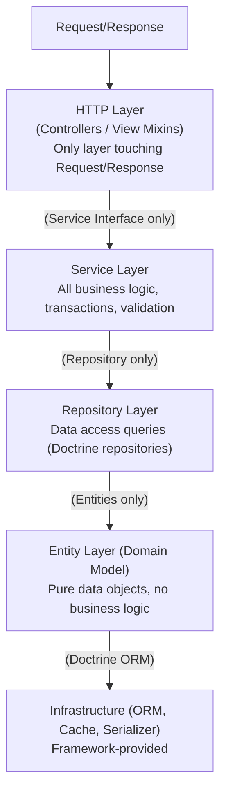

# System Architecture Contract

> Abstract architecture rules, layer boundaries, and dependency direction.
> **All modules, services, and controllers MUST conform to this contract.**

---

## 1. Layer Architecture



### 1.1 Layer Dependency Rules

| Rule | From | To | Allowed |
|------|------|----|---------|
| R1 | Controller | Service | **YES** |
| R2 | Controller | Entity | **YES** (type hints/returns only) |
| R3 | Controller | Repository | **NO** -- go through Service |
| R4 | Controller | EntityManager | **NO** -- go through Service |
| R5 | Service | Repository | **YES** |
| R6 | Service | Entity | **YES** |
| R7 | Service | EntityManager | **YES** |
| R8 | Service | Other Services | **YES** (via DI) |
| R9 | Entity | Repository | **NO** |
| R10 | Entity | Service | **NO** |
| R11 | Entity | EntityManager | **NO** |

---

## 2. Vertical Slice (Module) Structure

Each business domain is a self-contained module under `src/`:

```
src/{Module}/
|-- Controller/
|   |-- App/              # Client-facing endpoints (authenticated; may include writes when ownership-scoped)
|   |-- Public/           # Anonymous read-only endpoints (when applicable)
|   |-- Manage/           # Admin CRUD endpoints
|-- Entity/               # Domain entities (Doctrine)
|-- Repository/           # Data access (ServiceEntityRepository)
|-- Service/              # Business logic (extends BaseService)
|-- Exception/            # Module-specific exceptions
|-- EventListener/        # Module-specific event subscribers
|-- Command/              # CLI commands
|-- Resources/config/     # Module-specific DI configuration
```

### 2.1 Mandatory Artifacts per Module

| Artifact | Requirement |
|----------|-------------|
| Entity class(es) | PHP 8 attributes (Doctrine ORM), integer auto-increment `id` |
| Repository class(es) | Extends `ServiceEntityRepository` |
| Service class(es) | Extends `BaseService`, implements `{Name}ServiceInterface` |
| Service interface | Extends `BaseServiceInterface` (can be empty) |
| App controller(s) | Client-facing endpoints (authenticated; writes allowed when ownership/authorization-scoped) |
| Public controller(s) | Anonymous read-only endpoints (only for safe public data; optional) |
| Manage controller(s) | CRUD endpoints guarded by `ROLE_ADMIN` |

> **Defaults vs. exceptions**: The table is the default for CRUD aggregates
> (Category, Content, Order, Wallet, Store, etc.). Explicit exception
> categories exist for non-CRUD records and are documented in the owning
> bundle doc (`docs/design/bundles/*`) and `docs/design/data-model.md` §1.1:
> Inbox/Outbox (append-only + claim, no `updatedAt`/`__toString` per record),
> immutable audit / projection / ledger records, join / pivot tables, DTO / value
> objects, and infrastructure records (Messenger, cache). Those records do not
> require a dedicated repository per projection, `createdAt/updatedAt`, or a
> full CRUD controller set.

---

## 3. Cross-Module Communication Contract

### 3.1 Allowed

| From | To | Mechanism |
|------|----|-----------|
| Any Business Module | Core | DI (autowire Core services) |
| Business Module A | Business Module B | DI (autowire B's service **interface**) |
| Any Module | Identity | DI (TokenStorage for current user) |

### 3.2 Forbidden

| Pattern | Reason |
|---------|--------|
| Direct cross-module Entity access | Use service interface |
| Direct cross-module Repository access | Use service interface |
| Circular module dependencies | Violates layer architecture |
| Core importing business modules | Core is foundational |

### 3.3 Module Interface Contract

- Each module **exports** service interfaces (e.g., `CategoryServiceInterface`)
- Other modules **consume** only those interfaces, never concrete implementations
- Interfaces are auto-discovered via `services.yaml`

### 3.4 Cross-Boundary Identity Contract

Every persisted entity retains its local integer `id` primary key. Modules and future
services MUST NOT exchange that local auto-increment ID as a durable reference. Each
cross-boundary aggregate exposes a UUID or another explicitly documented immutable
business key.

| Context | Identifier to use |
|---------|-------------------|
| Local Doctrine relation inside one module | Integer `id` is allowed |
| Public API route/response | Numeric `id` or UUID through the Core identifier lookup; UUID is preferred when the aggregate has a durable external identity |
| Service interface crossing module boundary | UUID or documented immutable business key |
| Integration event aggregate/source/correlation id | UUID |
| Future service database relation | UUID/business key only; no cross-service FK |

An event carries scalar snapshots and external identities only. It MUST NOT carry a
Doctrine entity, repository, EntityManager, or a local primary key as a durable
reference. UUID lookup does not grant access; the receiving module still enforces its
own authorization and ownership rules.

Core CRUD routes retain `{id}` as their compatibility parameter name. The parameter
accepts either a digit-only local ID or a canonical UUID when the entity maps a unique
`uuid` field. A request must provide one identifier in the path, never separate `id`
and `uuid` values that could disagree. Digit-only values resolve only as IDs; UUID
values resolve only as UUIDs; an entity without a UUID field does not accept UUID input.

---

## 4. Core Framework (`src/Core/`)

Core provides foundational abstractions. It MUST NOT depend on any business module.

### 4.1 Core Exports (Public API)

| Export | Type | Consumer |
|--------|------|----------|
| `RestController` | Abstract class | All controllers |
| `BaseService` | Abstract class | All services |
| `BaseServiceInterface` | Interface | All service interfaces |
| `ExpressionDqlParser` | Service | Dynamic query compilation |
| `FlatNormalizer` | Serializer normalizer | Serializer pipeline |
| `ExceptionInterceptor` | Event listener | Global API error handling |
| View Mixins | PHP traits | All controller templates |
| Utility classes | Static helpers | Anywhere |

### 4.2 Core Constraints

- MUST NOT reference any business module namespace
- MUST NOT contain domain-specific business rules
- Extension points are provided via **override hooks** (not modification)

---

## 5. Dependency Injection Contract

### 5.1 Autowiring

- All `src/` classes autowired by default (`config/services.yaml` `App\`)
- Explicit exclusions (manually wired in `services.yaml`):
  - Decorators (e.g., `FlatNormalizer` decorates `serializer.normalizer.object`)
  - Security components (JwtAuthenticator, TokenManager)
  - SMS/OTP infrastructure adapters
  - Event listeners (for ordering)

### 5.2 Setter Injection for Controllers

Controllers extending `RestController` receive these via `#[Required]`:

| Dependency | Method |
|-------------|--------|
| `RequestStack` | `setRequestStack()` |
| `SerializerInterface` | `setSerializer()` |
| `TranslatorInterface` | `setTranslator()` |

### 5.3 Service Locator

Services use `ServiceLocatorInterface` (production: `DefaultServiceLocator` wrapping `ContainerInterface`; test: mock) to lazily access:
- `EntityManager`, Logger, TokenStorage, RequestStack, Serializer, Validator

### 5.4 Tagged Service Contract

Services implementing a pipeline interface are auto-tagged:

```yaml
services:
  App\Trade\Service\Pricing\:
    resource: '../src/Trade/Service/Pricing/'
    tags: ['trade.price_calculator']
```

Sorted by `getPriority(): int` method, executed in priority order.

---

## 6. Request Lifecycle

```
Request
  -> public/index.php
  -> App\Kernel (MicroKernelTrait)
  -> config/routes.yaml (prefix routing + namespace scan)
  -> Security firewall (JwtAuthenticator intercepts ^/api)
  -> Controller action (mixin method)
  -> Service method (business logic)
  -> Doctrine EntityManager (persistence)
  -> RestController::success()/warning() (JSON response)
```

### 6.1 Route Registration

| Scope | Mechanism |
|-------|-----------|
| Identity routes (`/api/auth/*`) | Direct `#[Route]` attributes on controller |
| Business API routes (`/api/v1/*`) | `config/routes.yaml` prefix + namespace scan |
| API documentation (`/api/doc`) | NelmioApiDocBundle route config |

### 6.2 Security Pipeline

| Route Pattern | Security |
|---------------|----------|
| `/api/doc`, `/api/doc.json` | PUBLIC_ACCESS |
| `/api/auth/login`, `/api/auth/otp/*`, `/api/auth/token/refresh`, `/api/auth/logout` | PUBLIC_ACCESS |
| `/api/v1/manage/*` | ROLE_ADMIN |
| `/api/*` | IS_AUTHENTICATED_FULLY |

---

## 7. Environment Contract

| File | Scope | Must Contain |
|------|-------|-------------|
| `.env` | Defaults (all envs) | `APP_ENV`, `APP_DEBUG`, `KERNEL_CLASS` |
| `.env.test` | Testing | `DATABASE_URL` (SQLite), test-mode toggles |
| `.env.example` | Template (committed) | All available env vars with documentation |
| `.env.local` | Local overrides (gitignored) | Developer-specific values |

Resolution order: `.env` -> `.env.{env}` -> `.env.local` -> `.env.{env}.local`

---

## 8. Infrastructure Contract

### 8.1 Database

| Environment | Database | Config |
|-------------|----------|--------|
| Production | MySQL 8 | `DATABASE_URL` env var |
| Testing | SQLite | `var/test.db` |
| Development | MySQL (Docker) | `compose.yaml` |

### 8.2 Migrations

- Doctrine Migrations under `migrations/`
- Each migration adds/alters tables for ONE module at a time
- File naming: `Version{YYYYMMDD}{HHMMSS}.php`
- Schema MUST be versioned -- no manual DB changes

### 8.3 Caching

| Cache | Backend | Purpose |
|-------|---------|---------|
| `cache.app` | Filesystem/Redis | Application cache |
| PSR-16 (expression cache) | Symfony Cache adapter | Compiled DQL expression caching |
| JWT Blacklist | Symfony Cache (TTL-based) | Revoked access token JTIs |

### 8.4 Serializer

- Default normalizer: `FlatNormalizer` (decorates ObjectNormalizer)
- Circular reference handler: returns entity ID or `spl_object_hash`
- `max_depth` + `enable_max_depth` + serializer groups for depth control
- Date/datetime: custom DateTimeNormalizer
