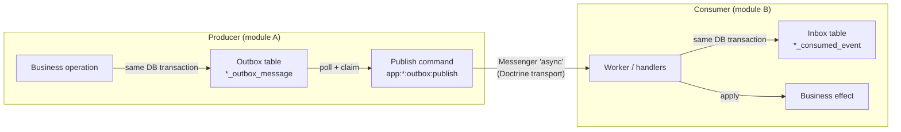
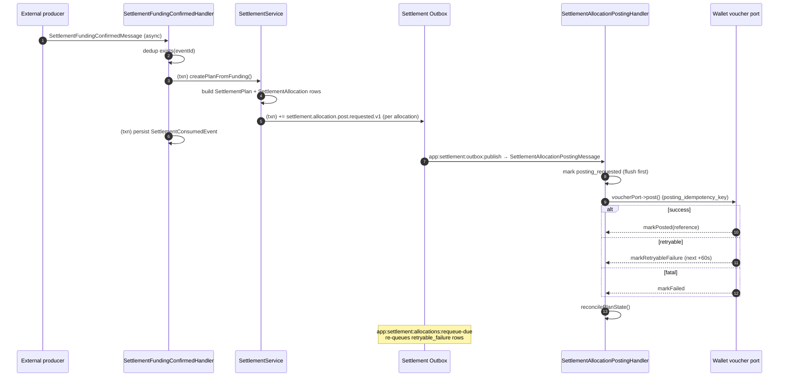

# Integration Events (Outbox / Inbox Pattern)

Modules in this project (Trade, Store, Inventory, Settlement, Wallet, Payment) share one
Kernel, one Doctrine EntityManager, and one Messenger bus, but they must **not** reach into
each other's entities or repositories. Cross-module communication is event-driven and
durable: a module *emits* facts it owns through **outboxes** and *consumes* facts from other
modules through **inboxes**, connected by Symfony Messenger.

The pattern protects against two failure modes:

- **Lost events** — an event is written in the *same DB transaction* as the business
  change (transactional outbox), so it is never lost even if the process dies mid-flight.
- **Duplicate delivery** — consumers record a consumed-event row in the *same transaction*
  as the business effect, keyed by `eventId` (idempotent inbox).



- **Producer side (outbox):** `*OutboxService::record(topic, aggregateType, aggregateId, payload)`
  inserts a row into the module's `*_outbox_message` table. A publish command
  (`app:<module>:outbox:publish`, one per module) polls the table, claims rows, builds
  an envelope, and dispatches a Messenger message onto the `async` transport.
- **Consumer side (inbox):** a `#[AsMessageHandler]` validates the envelope, checks the
  module's `*_consumed_event` table for the `eventId`, and inside one DB transaction both
  applies the effect and records the consumed-event row.

---

## 1. Transport configuration

`config/packages/messenger.yaml`:

```yaml
framework:
    messenger:
        failure_transport: failed          # dead-letter queue (doctrine://default?queue_name=failed)

        transports:
            async:
                dsn: '%env(MESSENGER_TRANSPORT_DSN)%'   # default: doctrine://default?auto_setup=0
                options:
                    use_notify: true
                    check_delayed_interval: 60000
                retry_strategy:
                    max_retries: 3
                    multiplier: 2
            failed: 'doctrine://default?queue_name=failed'

        routing:
            App\Trade\Message\TradeOrderCreatedMessage: async
            App\Trade\Message\TradeOrderCancelledMessage: async
            App\Trade\Message\StoreOrderAcceptedMessage: async
            App\Trade\Message\StoreOrderRejectedMessage: async
            App\Trade\Message\StoreOrderVerifiedMessage: async
            App\Inventory\Message\ReservationRequestedMessage: async
            App\Inventory\Message\ReservationReleaseRequestedMessage: async
            App\Inventory\Message\ReservationConfirmedMessage: async
            App\Inventory\Message\ReservationRejectedMessage: async
            App\Inventory\Message\ReservationReleasedMessage: async
            App\Settlement\Message\SettlementFundingConfirmedMessage: async
            App\Settlement\Message\SettlementAllocationPostingMessage: async
```

- All integration messages route to the single `async` transport (a Doctrine table
  `messenger_messages`), consumed by the `worker` Compose service:
  `messenger:consume async --time-limit=3600 --memory-limit=256M`.
- Messenger applies its own in-transport retry (3 retries, exponential multiplier 2);
  exhausted messages go to the `failed` transport.
- The outbox adds its own **claim/defer layer on top** (see
  [Publishing flow](#3-publishing-flow)) so the same envelope is never handed to
  Messenger twice, even if two scheduler ticks race.

## 2. Messages and envelopes

### 2.1 Message classes

Most module messages are thin `final readonly` carriers of a single `array $envelope`:

```php
final readonly class TradeOrderCreatedMessage
{
    /** @param array<string, mixed> $envelope */
    public function __construct(public array $envelope) {}
}
```

| Message | Produced by | Consumed by | Envelope-based |
|---------|------------|-------------|----------------|
| `App\Trade\Message\TradeOrderCreatedMessage` | Trade outbox | Store | ✅ `envelope` |
| `App\Trade\Message\TradeOrderCancelledMessage` | Trade outbox | Store | ✅ `envelope` |
| `App\Store\Message…` → `StoreOrderAcceptedMessage`, `StoreOrderRejectedMessage`, `StoreOrderVerifiedMessage` | Store outbox | Trade | ✅ `envelope` |
| `App\Inventory\Message\ReservationRequestedMessage` | Store outbox | Inventory | ✅ `envelope` |
| `App\Inventory\Message\ReservationReleaseRequestedMessage` | Store outbox | Inventory | ✅ `envelope` |
| `App\Inventory\Message\ReservationConfirmedMessage` | Inventory outbox | Store | ✅ `envelope` |
| `App\Inventory\Message\ReservationRejectedMessage` | Inventory outbox | Store | ✅ `envelope` |
| `App\Inventory\Message\ReservationReleasedMessage` | Inventory outbox | Store | ✅ `envelope` |
| `App\Settlement\Message\SettlementAllocationPostingMessage` | Settlement outbox | Settlement | ❌ explicit fields (`allocationUuid`, `planUuid`) |
| `App\Settlement\Message\SettlementFundingConfirmedMessage` | external producer (async) | Settlement | ❌ explicit fields |

The Store message classes live in the **Target** module's namespace are imported into the
producer command; e.g. `StoreOrderAcceptedMessage`/`StoreOrderRejectedMessage` are
`App\Trade\Message\*` classes consumed by `App\Trade\MessageHandler\*`, while
`ReservationRequestedMessage`/`ReservationReleaseRequestedMessage` are
`App\Inventory\Message\*` consumed by `App\Inventory\MessageHandler\*`.

### 2.2 Envelope structure

The publish commands assemble a versioned envelope from the outbox row. The Trade
publisher shows the fullest shape:

```php
$envelope = [
    'eventId'       => $message->getEventId(),                       // UUID v4, unique
    'type'          => str_replace('.v1', '', $message->getTopic()), // 'trade.order.created'
    'version'       => 1,
    'occurredAt'    => $message->getOccurredAt()->format(DATE_ATOM), // ISO-8601
    'aggregateType' => 'trade_order',
    'aggregateId'   => $message->getAggregateId(),                   // source aggregate uuid
    'correlationId' => $message->getAggregateId(),                   // trace scope
    'causationId'   => null,                                         // parent event (none at source)
    'payload'       => $message->getPayload(),
];
```

| Envelope key | Trade | Store | Inventory | Purpose |
|--------------|:-----:|:-----:|:---------:|---------|
| `eventId` | ✅ | ✅ | ✅ | UUID v4; idempotency key for the inbox |
| `type` | ✅ | ✅ | ✅ | Topic without the `.v1` suffix |
| `version` | ✅ | ✅ | ✅ | `1` |
| `occurredAt` | ✅ | — | — | When the source fact happened (ISO-8601 ATOM) |
| `aggregateType` | ✅ | — | — | Source aggregate kind |
| `aggregateId` | ✅ | ✅ | ✅ | Source aggregate uuid |
| `correlationId` | ✅ | — | — | Trace scope (set to the order uuid by Trade) |
| `causationId` | ✅ | — | — | Parent event id (null for source events) |
| `payload` | ✅ | ✅ | ✅ | Business data (array) |

`aggregate_type`, `aggregate_id`, `payload`, `occurred_at`, `available_at`, `published_at`,
`attempts`, and `last_error` are also persisted in the outbox table itself.

The Settlement `AllocationPostingMessage` and `SettlementFundingConfirmedMessage` instead
carry **explicit scalar fields** rather than an envelope (see
[Settlement flow](#44-settlement-allocation-posting)).

### 2.3 Topic catalogue

| Topic (`.v1` suffix = version) | Emitter outbox | Consumer |
|--------------------------------|----------------|----------|
| `trade.order.created.v1` | `trade_outbox_message` | Store (`TradeOrderCreatedHandler`) — only when `settings.order.requireAcceptance=true` |
| `trade.order.cancelled.v1` | `trade_outbox_message` | Store (`TradeOrderCancelledHandler`) |
| `store.order.accepted.v1` | `store_outbox_message` | Trade (`StoreOrderAcceptedHandler`) |
| `store.order.rejected.v1` | `store_outbox_message` | Trade (`StoreOrderRejectedHandler`) |
| `store.order.verified.v1` | `store_outbox_message` | Trade (`StoreOrderVerifiedHandler` → `request_verification` + `store_verify`) — only when `settings.fulfillment.requireVerification=true`; payload `{orderUuid, storeOrderUuid, storeUuid, verificationCode, verifiedBy, verifiedAt}` with audit |
| `inventory.reservation.requested.v1` | `store_outbox_message` | Inventory (`ReservationRequestedHandler`) |
| `inventory.reservation.release.requested.v1` | `store_outbox_message` | Inventory (`ReservationReleaseRequestedHandler`) |
| `inventory.reservation.confirmed.v1` | `inventory_outbox_message` | Store (`ReservationConfirmedHandler`) |
| `inventory.reservation.rejected.v1` | `inventory_outbox_message` | Store (`ReservationRejectedHandler`) |
| `inventory.reservation.released.v1` | `inventory_outbox_message` | Store (`ReservationReleasedHandler`) |
| `settlement.allocation.post.requested.v1` | `settlement_outbox_message` | Settlement (`SettlementAllocationPostingHandler`) |
| `settlement.funding.confirmed.v1` | — (async, external) | Settlement (`SettlementFundingConfirmedHandler`) |

## 3. Publishing flow

Every module with an outbox has a `Command/PublishOutboxCommand.php` registered as
`app:<module>:outbox:publish`. The scheduler in `compose.yaml` runs them every
`OUTBOX_PUBLISH_INTERVAL` (default `5`s).

```yaml
scheduler:
  extends:
    service: app
  command:
    - /bin/sh
    - -ec
    - |
      while :; do
        php bin/console app:trade:outbox:publish --no-interaction
        php bin/console app:store:outbox:publish --no-interaction
        php bin/console app:inventory:outbox:publish --no-interaction
        php bin/console app:inventory:reservations:release-expired --no-interaction
        php bin/console app:settlement:allocations:requeue-due --no-interaction
        php bin/console app:settlement:outbox:publish --no-interaction
        sleep "${OUTBOX_PUBLISH_INTERVAL:-5}"
      done
```

The three standard steps (identical for Trade, Store, Inventory, Settlement):

1. **Select** unpublished rows older than their `available_at`
   (`findUnpublished()` — `published_at IS NULL AND available_at <= now ORDER BY id ASC LIMIT 100`).
2. **Claim** — `claim($id, now + 1 minute)` runs an atomic
   `UPDATE … SET available_at = :until WHERE id = :id AND published_at IS NULL AND available_at <= now`
   and returns `true` only when one row was updated. This is the concurrency guard: a
   second tick (or a restarted scheduler) will skip rows another worker has claimed.
3. **Dispatch** the matching bus message. On success `markPublished()` stamps
   `published_at`. On any `\Throwable` (or an unsupported topic) `defer($id, $error, now + 5 min)`
   increments `attempts`, stores `last_error`, and pushes `available_at` out so the row
   can be retried by a later tick. Finally the EntityManager is flushed once.

Trade's publisher also whitelists topics and treats anything else as an unsupported topic:

```php
if (!in_array($message->getTopic(), ['trade.order.created.v1', 'trade.order.cancelled.v1'], true)) {
    $this->repository->defer($id, 'Unsupported Trade outbox topic: ' . $message->getTopic(), new \DateTimeImmutable('+5 minutes'));
    continue;
}
```

The Inventory publisher is the outlier: it selects an **array projection**
(`findUnpublishedForPublishing()`) and marks published/records attempts through direct
repository UPDATEs instead of through the Unit of Work, so it does not flush entity state.

> **Delivery guarantee vs ordering.** Delivery is at-least-once and retried with a 1-minute
> claim lease and 5-minute backoff. Ordering is best-effort per outbox by `id`; consumers
> must be order-tolerant (they guard on workflow/state `can()`), which is exactly what the
> handlers do.

## 4. Consuming flow and idempotency

### 4.1 Inbox (consumed-event) tables

| Table | id | event_id | payload trace columns |
|-------|----|----------|----------------------|
| `store_consumed_event` | BIGINT | `VARCHAR(36)` UNIQUE | `aggregate_id`, `payload_hash(64)` |
| `inventory_consumed_event` | BIGINT | `VARCHAR(36)` UNIQUE | `aggregate_id`, `payload_hash(64)` |
| `settlement_consumed_event` | INT | `VARCHAR(64)` UNIQUE | `source_aggregate_type`, `source_aggregate_id`, `payload_hash(64)` |

All three share `topic`, `processed_at`, and `payload_hash` (SHA-256 of the JSON-encoded
envelope). Trade has **no inbox table**: its handlers are guarded by the workflow's
`can(transition)` check plus the store-uuid snapshot match inside a transaction, so a
duplicate `store.order.accepted.v1` / `store.order.rejected.v1` is a no-op.

### 4.2 Idempotency by `eventId`

The canonical consumer shape — read-check, then re-check inside the transaction, and
write the consumed row atomically with the effect:

```php
public function __invoke(TradeOrderCreatedMessage $message): void
{
    $eventId = $message->envelope['eventId'] ?? null;
    $payload = $message->envelope['payload'] ?? null;
    // ...validate...

    if ($this->consumedEventRepository->findOneBy(['eventId' => $eventId]) !== null) {
        return; // already processed
    }

    $this->entityManager->wrapInTransaction(function () use ($eventId, ...): void {
        if ($this->consumedEventRepository->findOneBy(['eventId' => $eventId]) !== null) {
            return; // re-check under the transaction (closes the race window)
        }
        $this->entityManager->persist(new StoreConsumedEvent(
            $eventId,
            'trade.order.created.v1',
            (string) ($payload['orderUuid'] ?? ''),
            hash('sha256', json_encode($message->envelope, JSON_THROW_ON_ERROR)),
        ));
        // ...apply the business effect...
    });
}
```

Inventory tightens this further. Its `isAlreadyConsumed()` compares the stored
`payload_hash` with the hash of the arriving envelope using `hash_equals`; a reused
`eventId` with a **different** payload raises `InventoryMessageIntegrityException`
("Event ID was reused with a different payload"). Settlement's `exists($eventId)` check is
simpler: a reused id is silently skipped.

### 4.3 Validation

Handlers validate their envelopes defensively before touching the database:

- `type` / `version` exact match (e.g. `'inventory.reservation.released'` / `1`).
- Required keys exist with the right scalar types (`eventId` is a non-empty string in the
  Store handlers; the Inventory handlers additionally require it to be a well-formed UUID).
- Inventory additionally validates: `aggregateId === payload['reservationId']`,
  UUID format `^[0-9a-f]{8}-…-[1-8]…-[89ab]…$` for every id, ISO-8601 timestamps
  (fractional seconds allowed), unique line ids, and quantity strings matching
  `^[0-9]+(?:\.[0-9]{1,6})?$`.
- Correlation cross-checks (e.g. `ReservationReleaseRequestedHandler` verifies the
  `storeUuid` / `tradeOrderUuid` / `storeOrderUuid` in the envelope match the stored
  reservation, else it throws `InventoryMessageIntegrityException`).
- Business guards that make retries harmless: `ReservationConfirmedHandler` only
  accepts a Store order that is still `awaiting_inventory` and whose
  `reservationId == payload['reservationId']`; `SettlementService::postAllocation()`
  returns early for already-`posted` / `cancelled` / `reversed` allocations.

## 5. Correlation / causation tracing

- **Trade** assigns `correlationId = aggregateId` (the trade order uuid) and
  `causationId = null` on every outbound envelope — the whole order saga (order created →
  store acceptance → inventory reservation → cancellation) shares that correlation scope.
- **Settlement** is the only module that persists the trace into its domain model:
  `SettlementFundingConfirmedMessage` carries `correlationId`/`causationId`, and
  `settlement_plan` stores `correlation_id` and `causation_id` columns. The
  `SettlementFundingConfirmedHandler` copies them into the `SettlementFunding` contract.
- **Store / Inventory** envelopes do not carry correlation/causation headers; lineage is
  reconstructed from payload correlation keys — `orderUuid`, `storeUuid`,
  `tradeOrderUuid`, `storeOrderUuid`, `reservationId` — and from the consumed-event
  `aggregate_id` column.

## 6. Reference flows

### 6.1 Trade order → Store → Inventory reservation

```mermaid
sequenceDiagram
    autonumber
    participant T as Trade
    participant TO as Trade Outbox
    participant S as Store
    participant SO as Store Outbox
    participant I as Inventory
    participant IO as Inventory Outbox

    T->>T: OrderService::createOrder()<br/>(txn) workflow store_submit
    T->>TO: (txn) += trade.order.created.v1
    TO->>S: app:trade:outbox:publish → TradeOrderCreatedMessage
    S->>S: (txn) inbox += trade.order.created.v1
    alt store inactive
        S->>SO: (txn) += store.order.rejected.v1 (STORE_UNAVAILABLE)
    else INVENTORY_ENABLED=0
        S->>S: accept immediately
    else reserve
        S->>SO: (txn) += inventory.reservation.requested.v1
        SO->>I: app:store:outbox:publish → ReservationRequestedMessage
        I->>I: (txn) inbox += requested; InventoryService::reserve()
        alt shortfall
            I->>IO: (txn) += inventory.reservation.rejected.v1
        else success
            I->>IO: (txn) += inventory.reservation.confirmed.v1
        end
        IO->>S: app:inventory:outbox:publish → ReservationConfirmed/Rejected
        S->>S: (txn) inbox += outcome; accept/reject storeOrder
        S->>SO: (txn) += store.order.rejected.v1 (if rejected)
        SO->>T: app:store:outbox:publish → StoreOrderRejectedMessage
        T->>T: workflow store_reject / store_accept
    end
```

### 6.2 Order cancellation → Store → Inventory release

```mermaid
sequenceDiagram
    autonumber
    participant T as Trade
    participant TO as Trade Outbox
    participant S as Store
    participant SO as Store Outbox
    participant I as Inventory
    participant IO as Inventory Outbox

    T->>T: OrderWorkflowListener (transition 'cancel')
    alt order has store metadata
        T->>TO: (txn) += trade.order.cancelled.v1
        TO->>S: app:trade:outbox:publish → TradeOrderCancelledMessage
        S->>S: (txn) inbox += trade.order.cancelled.v1
        alt store order exists
            S->>S: cancel it
            S->>SO: (txn) += inventory.reservation.release.requested.v1
            SO->>I: app:store:outbox:publish → ReservationReleaseRequestedMessage
            I->>I: (txn) inbox += release.requested; InventoryService::release()
            I->>IO: (txn) += inventory.reservation.released.v1
            IO->>S: app:inventory:outbox:publish → ReservationReleasedMessage
            S->>S: inbox dedup only
        else store order missing
            S->>S: persist StoreTradeOrderCancellation (applied later)
        end
    end
```

### 6.3 Fulfilled → Store verification → Completed (when `fulfillment.requireVerification=true`)

```mermaid
sequenceDiagram
    autonumber
    participant T as Trade
    participant S as Store
    participant SO as Store Outbox
    participant TO as Trade Outbox

    T->>T: fulfill: paid --fulfill--> fulfilled (OrderWorkflowListener sets fulfilledAt)
    S->>S: StoreOrder fulfill (if accepted) -> fulfilled
    S->>S: POST /store/{scopeId}/orders/{uuid}/verify {verificationCode}<br/>StoreOrderService::verify() (txn) verify(code, verifiedBy) -> verifiedAt
    S->>SO: (txn) += store.order.verified.v1 {orderUuid, storeOrderUuid, storeUuid, verificationCode, verifiedBy, verifiedAt}
    SO->>T: app:store:outbox:publish -> StoreOrderVerifiedMessage
    T->>T: (txn) StoreOrderVerifiedHandler: if can(request_verification) apply -> awaiting_store_verification; if can(store_verify) apply -> completed (Trade OrderWorkflowListener sets completedAt via status-driven completed)
```

Guard `StoreOrderWorkflowGuardListener` blocks direct `fulfilled --complete--> completed` when `requireVerification=true` and allows `request_verification` + `store_verify`. Trade `OrderWorkflowListener` handles `completed` status-driven so it never hard-codes `store_verify`. Store `verificationCode` is required (≤64) and `verifiedBy` is the acting staff `userUuid`.

### 6.4 Expired reservations

`app:inventory:reservations:release-expired` →
`InventoryService::releaseExpiredReservations()` finds `confirmed` reservations past
`expires_at` and releases them with reason `reservation expired`, which re-enters the
standard `inventory.reservation.released.v1` outbox flow above.

### 6.5 Settlement allocation posting

Settlement is an **inbox-first** module: funding confirmations arrive from outside as
explicit-field messages.



Statuses used by the settlement retry loop: allocation `planned → posting_requested →
posted` (terminal `cancelled`/`failed`/`reversed`/`reversal_pending`), with
`retryable_failure` feeding `requeue-due`. In test fixtures the voucher boundary is the
`InMemorySettlementVoucherPort`.

## 7. Operational notes

- **Dead letters** accumulate on the `failed` transport (`messenger_messages` with
  `queue_name = 'failed'`); the outbox row is left unpublished so it can be manually
  re-queued or repaired.
- **Stuck rows** show up as `published_at IS NULL` with a non-null `last_error`; they are
  re-attempted automatically after their `available_at` passes.
- **Race safety** relies on the claim UPDATE being conditional (`published_at IS NULL AND
  available_at <= now`), plus the index `(published_at, available_at)` on each outbox
  table (Inventory appends `id`).
- The `INVENTORY_ENABLED` environment toggle decides whether Store skips inventory
  altogether and accepts orders immediately, or waits for an `inventory.reservation.confirmed.v1`.