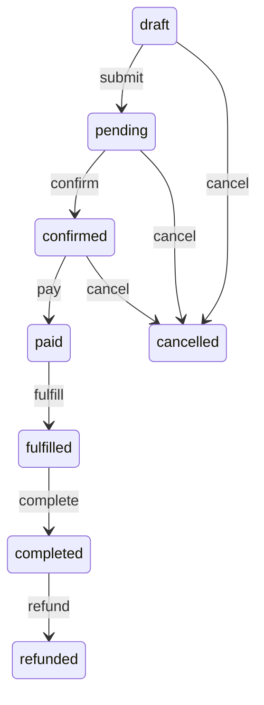
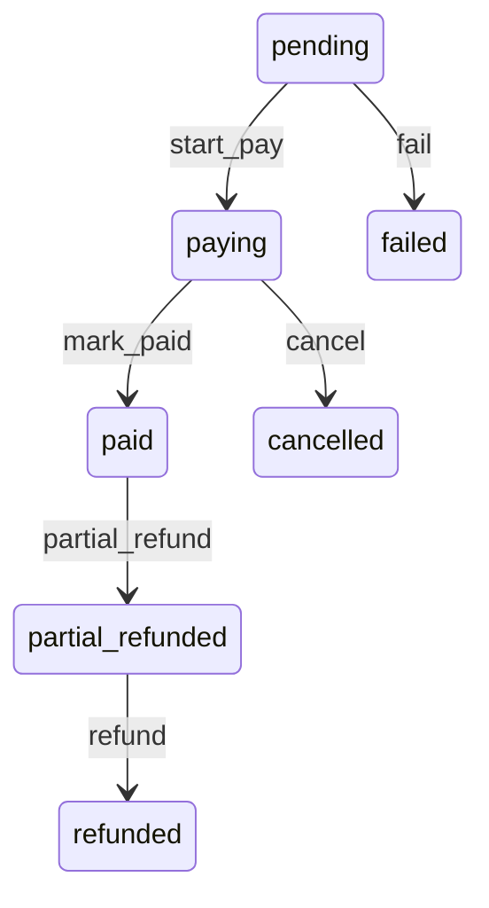

# Order And Payment API Flow

This document is for frontend integration of the user order, payment, cancellation, and refund flow.

Base path: `/api/v1`

Auth: app endpoints require `Authorization: Bearer <access_token>` unless explicitly noted.

Response envelope:

```json
{
  "data": {},
  "code": 0,
  "message": "SUCCESS"
}
```

Amounts are stored as integer cents/fen. For example, `1234` means `12.34 CNY`.

## Status Enums

### Order Status

| Status | Meaning | Frontend meaning |
| --- | --- | --- |
| `draft` | Order created but not submitted/confirmed | Created, not payable yet |
| `pending` | Submitted and waiting for confirmation | Ready for user/backend confirmation |
| `confirmed` | Confirmed and can start payment | Payable |
| `paid` | Payment completed | Paid, waiting fulfillment |
| `fulfilled` | Order shipped/fulfilled | Waiting completion/receipt |
| `completed` | Order completed | Completed, refundable by backend flow |
| `cancelled` | Order cancelled | Cancelled |
| `refunded` | Order fully refunded | Refunded |

Order workflow:



Cancellation is allowed only from `draft`, `pending`, or `confirmed`.

Refund is allowed only from `completed`.

### Invoice Status

| Status | Meaning | Frontend meaning |
| --- | --- | --- |
| `pending` | Invoice created but payment not started | Waiting payment start |
| `paying` | Payment started, waiting gateway result | Waiting user payment or gateway callback |
| `paid` | Payment completed | Paid |
| `failed` | Payment failed | Payment failed, can retry by creating/using payable invoice flow if allowed |
| `cancelled` | Invoice cancelled | Payment cancelled |
| `partial_refunded` | Partially refunded | Partial refund completed |
| `refunded` | Fully refunded | Full refund completed |

Invoice workflow:



Invoice `paid/refunded/cancelled/failed` events update the linked order payment fields automatically when the invoice source is a trade order.

## User-Side Order Transitions

`POST /api/v1/app/orders` creates an order in `draft` status.

`POST /api/v1/app/orders/{id}/payment` can only pay an order in `confirmed` status.

The user can move their own order to payable status without admin intervention:

```http
POST /api/v1/app/orders/{id}/submit
Authorization: Bearer <access_token>
```

```http
POST /api/v1/app/orders/{id}/confirm
Authorization: Bearer <access_token>
```

Only the current user's own order can be submitted or confirmed. Other users' orders return `404`.

After the order becomes `confirmed`, the frontend can call the user payment endpoint.

## User Order Flow

### 1. List Products

Only active and non-deleted products are returned.

```http
GET /api/v1/app/products?page=1&limit=20
Authorization: Bearer <access_token>
```

Example response fields:

```json
{
  "data": [
    {
      "id": 1,
      "uuid": "...",
      "name": "Product A",
      "description": "...",
      "status": "active",
      "isDeleted": false,
      "metadata": null
    }
  ],
  "code": 0,
  "message": "SUCCESS"
}
```

### 2. Get Product Detail

```http
GET /api/v1/app/products/{productId}
Authorization: Bearer <access_token>
```

### 3. List Product Specifications

Only active and non-deleted specifications are returned.

```http
GET /api/v1/app/specifications/by-product/{productId}
Authorization: Bearer <access_token>
```

Example response fields:

```json
{
  "data": [
    {
      "id": 10,
      "name": "Default",
      "price": 1500,
      "priceAsFloat": 15.0,
      "status": "active",
      "sort": 0,
      "isDeleted": false
    }
  ],
  "code": 0,
  "message": "SUCCESS"
}
```

### 4. Create Order

```http
POST /api/v1/app/orders
Authorization: Bearer <access_token>
Content-Type: application/json
```

Request:

```json
{
  "items": [
    { "specificationId": 10, "quantity": 2 },
    { "specificationId": 11, "quantity": 1 }
  ],
  "currency": "CNY",
  "notes": "Please ship quickly",
  "metadata": {
    "receiver": {
      "name": "Zhang San",
      "phone": "13800138000",
      "address": "Nanshan, Shenzhen"
    }
  }
}
```

Rules:

| Field | Required | Notes |
| --- | --- | --- |
| `items` | yes | Non-empty array |
| `items[].specificationId` | yes | Specification id |
| `items[].quantity` | yes | Must be at least `1` |
| `currency` | no | Defaults to `CNY` |
| `notes` | no | Customer note |
| `metadata` | no | Saved as-is into `trade_order.metadata`, suitable for receiver/address snapshots and other frontend payloads |

Example response:

```json
{
  "data": {
    "id": 123,
    "uuid": "...",
    "totalAmount": 4500,
    "totalAmountAsFloat": 45.0,
    "currency": "CNY",
    "status": "draft",
    "notes": "Please ship quickly",
    "metadata": {
      "receiver": {
        "name": "Zhang San",
        "phone": "13800138000",
        "address": "Nanshan, Shenzhen"
      }
    },
    "paymentMethod": null,
    "invoiceId": null,
    "invoiceNo": null,
    "paymentStatus": null,
    "createdAt": "..."
  },
  "code": 0,
  "message": "Order created"
}
```

### 5. List My Orders

```http
GET /api/v1/app/orders?page=1&limit=20
Authorization: Bearer <access_token>
```

Only current user's orders are returned.

Useful filters:

```http
GET /api/v1/app/orders?@filter=entity.getStatus() == 'paid'
```

### 6. Get Order Detail

```http
GET /api/v1/app/orders/{orderId}
Authorization: Bearer <access_token>
```

Only current user's own order can be read. Other users' orders return `404`.

### 7. Get Order Items

```http
GET /api/v1/app/orders/{orderId}/items
Authorization: Bearer <access_token>
```

Example response fields:

```json
{
  "data": [
    {
      "id": 1,
      "uuid": "...",
      "specificationTitle": "Default",
      "quantity": 2,
      "unitPrice": 1500,
      "price": 3000,
      "specSnapshot": {
        "id": 10,
        "name": "Default",
        "productId": 1
      },
      "productSnapshot": {
        "id": 1,
        "name": "Product A"
      }
    }
  ],
  "code": 0,
  "message": "SUCCESS"
}
```

## Payment Flow

### 1. Make Order Payable

Current implementation requires the order to be `confirmed` before user payment.

User app flow:

```http
POST /api/v1/app/orders/{orderId}/submit
Authorization: Bearer <access_token>
```

```http
POST /api/v1/app/orders/{orderId}/confirm
Authorization: Bearer <access_token>
```

The order is now `confirmed` and can be paid.

Admin/backend can still use `POST /api/v1/manage/orders/{orderId}/do/{transition}` for operational workflows.

### 2. Start Order Payment

```http
POST /api/v1/app/orders/{orderId}/payment
Authorization: Bearer <access_token>
Content-Type: application/json
```

Mock payment request:

```json
{
  "payment": "mock"
}
```

Wallet payment request:

```json
{
  "payment": "wallet",
  "systemWalletId": 99
}
```

Mixed wallet deduction + gateway payment request:

```json
{
  "payment": "mock",
  "walletAmount": 1000,
  "systemWalletId": 99
}
```

Mock auto-paid request for development/testing:

```json
{
  "payment": "mock",
  "autoPaid": true
}
```

Supported payment values:

| payment | Meaning |
| --- | --- |
| `mock` | Mock gateway for development/testing |
| `wallet` | Wallet balance payment |
| `wechat` | WeChat Pay gateway, including Mini Program JSAPI payment, if configured |

Common payment options:

| Field | Required | Notes |
| --- | --- | --- |
| `payment` | no | Defaults to `mock` |
| `systemWalletId` | for wallet payment/deduction | Target system wallet id |
| `walletAmount` | no | Deduct part of invoice from wallet balance before gateway payment |
| `autoPaid` | mock only | If `true`, mock gateway immediately marks invoice paid |
| `gateway` | no | Saved to invoice gateway field |
| `tradeType` | no | Saved to invoice trade type. WeChat currently supports `jsapi` and `native`. Mini Program payment uses `jsapi`. |

Example response for mock payment not yet paid:

```json
{
  "data": {
    "invoice": {
      "id": 88,
      "uuid": "...",
      "outTradeNo": "PAY20260704120000ABCDEF12",
      "sourceType": "trade_order",
      "sourceId": "<order_uuid>",
      "scene": "order",
      "payment": "mock",
      "status": "paying",
      "amount": 4500,
      "currency": "CNY"
    },
    "status": "paying",
    "payUrl": "/mock/pay/PAY20260704120000ABCDEF12",
    "qrCode": null,
    "payload": {
      "gateway": "mock",
      "outTradeNo": "PAY20260704120000ABCDEF12",
      "amount": 4500,
      "transactionId": "mock-PAY20260704120000ABCDEF12"
    },
    "message": "Mock payment created"
  },
  "code": 0,
  "message": "Payment started"
}
```

If payment completes synchronously, such as `wallet` or `mock` with `autoPaid: true`, the returned `status` is `paid`, invoice status becomes `paid`, and linked order status becomes `paid` automatically.

## WeChat Mini Program Payment

WeChat Mini Program payment uses the `wechat` payment gateway with `tradeType: "jsapi"`.

### Prerequisites

The user must log in through WeChat Mini Program before starting JSAPI payment. This creates or finds the local user and stores the WeChat `openid` mapping used by payment.

```http
POST /api/wechat/miniapp/login
Content-Type: application/json
```

Request:

```json
{
  "js_code": "wx.login returned code"
}
```

Response:

```json
{
  "access_token": "<jwt>",
  "expires_in": 7200,
  "refresh_token": "<refresh_token>"
}
```

Use `access_token` as the Bearer token for order/payment APIs.

Optional phone binding:

```http
POST /api/wechat/miniapp/phone
Authorization: Bearer <access_token>
Content-Type: application/json
```

```json
{
  "code": "getPhoneNumber returned code"
}
```

Server configuration required for WeChat Pay:

| Env | Meaning |
| --- | --- |
| `WECHAT_MINIAPP_APP_ID` | Mini Program app id |
| `WECHAT_MINIAPP_SECRET` | Mini Program secret |
| `WECHAT_PAY_MCH_ID` | WeChat Pay merchant id |
| `WECHAT_PAY_SECRET_KEY` | API v3 secret key |
| `WECHAT_PAY_PRIVATE_KEY` | Merchant private key path |
| `WECHAT_PAY_CERTIFICATE` | Merchant certificate path |
| `WECHAT_PAY_NOTIFY_URL` | Public notify URL, should route to `/api/payment/notify/wechat` |

### Start Mini Program Payment

The order must already be `confirmed`. For user-side flow, call `POST /api/v1/app/orders/{orderId}/submit` and then `POST /api/v1/app/orders/{orderId}/confirm` before starting payment.

```http
POST /api/v1/app/orders/{orderId}/payment
Authorization: Bearer <access_token>
Content-Type: application/json
```

Request:

```json
{
  "payment": "wechat",
  "tradeType": "jsapi"
}
```

If using wallet balance deduction before WeChat payment:

```json
{
  "payment": "wechat",
  "tradeType": "jsapi",
  "walletAmount": 1000,
  "systemWalletId": 99
}
```

Example response:

```json
{
  "data": {
    "invoice": {
      "id": 88,
      "uuid": "...",
      "outTradeNo": "PAY20260704120000ABCDEF12",
      "sourceType": "trade_order",
      "sourceId": "<order_uuid>",
      "scene": "order",
      "payment": "wechat",
      "tradeType": "jsapi",
      "status": "paying",
      "amount": 4500,
      "currency": "CNY"
    },
    "status": "paying",
    "payUrl": null,
    "qrCode": null,
    "payload": {
      "timeStamp": "1234567890",
      "nonceStr": "abc123",
      "package": "prepay_id=wx_prepay_jsapi_001",
      "signType": "RSA",
      "paySign": "sign_abc"
    },
    "message": "WeChat JSAPI order created"
  },
  "code": 0,
  "message": "Payment started"
}
```

Frontend Mini Program call:

```js
wx.requestPayment({
  timeStamp: payload.timeStamp,
  nonceStr: payload.nonceStr,
  package: payload.package,
  signType: payload.signType,
  paySign: payload.paySign,
  success() {
    // Payment UI succeeded. Final payment status still depends on server notify.
    // Poll GET /api/v1/app/orders/{orderId} until status becomes paid.
  },
  fail(err) {
    // User cancelled or payment failed in the client UI.
    // Keep order as confirmed/paying and allow retry, or ask backend to cancel if needed.
  }
});
```

Important frontend notes:

| Point | Meaning |
| --- | --- |
| `wx.requestPayment.success` | Only means the client payment UI completed. Use server order/invoice status as source of truth. |
| Polling target | `GET /api/v1/app/orders/{orderId}` or `GET /api/v1/app/invoices/{invoiceId}` |
| Success final state | Order `paid`, invoice `paid` |
| Retry | If order remains `confirmed` and invoice/payment status is `paying` or `failed`, frontend can show retry according to backend policy. |

### WeChat Pay Notify

WeChat Pay sends server callback to the configured `WECHAT_PAY_NOTIFY_URL`, which should point to:

```http
POST /api/payment/notify/wechat
```

The server verifies the WeChat signature and decrypts the event through EasyWeChat. On success it returns:

```json
{
  "code": "SUCCESS",
  "message": "成功"
}
```

After valid notify:

| Entity | Result |
| --- | --- |
| Invoice | `paid`, `transactionId` saved from WeChat transaction id |
| Order | `paid` through invoice paid event listener |
| Order payment fields | `paymentMethod=wechat`, `paymentStatus=paid`, `invoiceId`, `invoiceNo`, `paidAt` updated |

### WeChat Native Payment

The same gateway also supports WeChat Native QR payment for non-mini-program scenarios.

```json
{
  "payment": "wechat",
  "tradeType": "native"
}
```

Response returns `payUrl` as WeChat `code_url`. The frontend can render it as a QR code.

### 3. Handle Gateway Callback

The external payment gateway posts to:

```http
POST /api/payment/notify/{payment}
Content-Type: application/json
```

Mock notify example:

```json
{
  "secret": "mock",
  "outTradeNo": "PAY20260704120000ABCDEF12",
  "status": "paid",
  "amount": 4500,
  "currency": "CNY",
  "transactionId": "mock-txn-001"
}
```

Success response:

```text
SUCCESS
```

Failed response:

```text
FAIL
```

When notify succeeds with `status: paid`:

| Entity | Result |
| --- | --- |
| Invoice | `paid` |
| Order | `paid` |
| Order payment fields | `paymentMethod`, `invoiceId`, `invoiceNo`, `paymentStatus`, `paidAt` are updated |

### 4. Poll Order Or Invoice After Payment

Poll order:

```http
GET /api/v1/app/orders/{orderId}
Authorization: Bearer <access_token>
```

Poll invoice:

```http
GET /api/v1/app/invoices/{invoiceId}
Authorization: Bearer <access_token>
```

List my invoices:

```http
GET /api/v1/app/invoices?page=1&limit=20
Authorization: Bearer <access_token>
```

Pay an existing invoice directly:

```http
POST /api/v1/app/invoices/{invoiceId}/pay/{payment}
Authorization: Bearer <access_token>
Content-Type: application/json
```

Example:

```json
{
  "autoPaid": true
}
```

## Cancellation Flow

### User Cancel Order

```http
POST /api/v1/app/orders/{orderId}/cancel
Authorization: Bearer <access_token>
```

Allowed only when order status is `draft`, `pending`, or `confirmed`.

If the order has a linked invoice, cancellation also cancels that invoice. If wallet deduction was applied to the invoice, cancellation releases the deduction and returns wallet balance.

Example success response:

```json
{
  "data": {
    "id": 123,
    "status": "cancelled",
    "cancelledAt": "...",
    "paymentStatus": "cancelled"
  },
  "code": 0,
  "message": "Order cancelled"
}
```

Common failure:

```json
{
  "code": 400,
  "message": "Order cannot be cancelled in current status.",
  "raw_data": ""
}
```

### Admin Cancel Order

```http
POST /api/v1/manage/orders/{orderId}/do/cancel
Authorization: Bearer <admin_access_token>
```

### Admin Cancel Invoice Directly

```http
POST /api/v1/manage/invoices/{invoiceId}/cancel
Authorization: Bearer <admin_access_token>
Content-Type: application/json
```

Request:

```json
{
  "reason": "Customer cancelled before payment"
}
```

## Fulfillment And Completion Flow

These are admin/backend operations in the current implementation.

### Fulfill Order

```http
POST /api/v1/manage/orders/{orderId}/fulfill
Authorization: Bearer <admin_access_token>
Content-Type: application/json
```

Allowed only from `paid`.

Request:

```json
{
  "trackingNumber": "TRACK-001",
  "shippingAddress": "Address snapshot"
}
```

Result: order status becomes `fulfilled`. For Store projection, Staff should also `POST /api/v1/store/{scopeId}/orders/{orderUuid}/fulfill` to mark `StoreOrder` fulfilled before verification.

### Store Verify (when Store requires verification)

```http
POST /api/v1/store/{scopeId}/orders/{orderUuid}/verify
Authorization: Bearer <access_token> (store member)
Content-Type: application/json
```

No body required; the order UUID itself is the verification token. Requires `StoreOrder` in `fulfilled` and `fulfillment.requireVerification=true` snapshotted at order creation.

```json
{}
```

Result: `StoreOrder` becomes `verified` and emits `store.order.verified.v1`; the linked `TradeOrder` completes automatically (`fulfilled → completed`), or immediately after `fulfill` if verification arrived out-of-order.

### Complete Order

```http
POST /api/v1/manage/orders/{orderId}/do/complete
Authorization: Bearer <admin_access_token>
```

Allowed only from `fulfilled`.

Result: order status becomes `completed`.

> Store-verified orders: if the order was created with `X-Store-Code` and the Store has `fulfillment.requireVerification=true`, the order's `_completionMode` is `store_verification`. Manual `do/complete` is then blocked (`Store verification is required`) and completion happens automatically after `POST /api/v1/store/{scopeId}/orders/{uuid}/verify` (fulfilled → verified) emits `store.order.verified.v1`. If verification arrived before fulfillment, completion is applied right after `fulfill`.

## Refund Flow

Refunds are admin/backend operations in the current implementation.

### Refund Order

```http
POST /api/v1/manage/orders/{orderId}/refund
Authorization: Bearer <admin_access_token>
Content-Type: application/json
```

Allowed only from `completed`.

Request:

```json
{
  "reason": "Customer requested refund",
  "systemWalletId": 99
}
```

Rules:

| Case | Behavior |
| --- | --- |
| Order has linked invoice | Calls invoice refund for remaining invoice amount. `systemWalletId` is needed if the payment/refund path uses wallet. |
| Order has no linked invoice | Uses wallet transfer refund and requires `systemWalletId`. |
| Invoice has wallet deduction | Adjusted invoices only support full refund. |

Example response:

```json
{
  "data": {
    "invoice": {
      "id": 88,
      "status": "refunded",
      "refundedAmount": 4500
    },
    "amount": 4500,
    "status": "refunded",
    "refundId": "mock-refund-PAY20260704120000ABCDEF12-4500",
    "rawData": {
      "gateway": {
        "reason": "Customer requested refund",
        "amount": 4500,
        "paidAmount": 4500
      }
    }
  },
  "code": 0,
  "message": "Refund processed"
}
```

When the invoice becomes fully `refunded`, the linked order becomes `refunded` automatically.

### Refund Invoice Directly

```http
POST /api/v1/manage/invoices/{invoiceId}/refund
Authorization: Bearer <admin_access_token>
Content-Type: application/json
```

Request:

```json
{
  "amount": 4500,
  "reason": "Customer requested refund",
  "systemWalletId": 99
}
```

`amount` can be integer cents/fen or decimal string, for example `4500` or `"45.00"`.

## Admin Workflow Helpers

### Get Available Order Transitions

```http
GET /api/v1/manage/orders/{orderId}/transitions
Authorization: Bearer <admin_access_token>
```

Example response field:

```json
{
  "data": [
    { "name": "submit" },
    { "name": "cancel" }
  ],
  "code": 0,
  "message": "SUCCESS"
}
```

### Apply Generic Order Transition

```http
POST /api/v1/manage/orders/{orderId}/do/{transition}
Authorization: Bearer <admin_access_token>
Content-Type: application/json
```

Supported transitions:

| Transition | From | To |
| --- | --- | --- |
| `submit` | `draft` | `pending` |
| `confirm` | `pending` | `confirmed` |
| `pay` | `confirmed` | `paid` |
| `fulfill` | `paid` | `fulfilled` |
| `complete` | `fulfilled` | `completed` |
| `cancel` | `draft`, `pending`, `confirmed` | `cancelled` |
| `refund` | `completed` | `refunded` |

The body is optional. If present, supported order fields are updated before transition.

Example:

```json
{
  "notes": "confirmed by backend"
}
```

### Get Available Invoice Transitions

```http
GET /api/v1/manage/invoices/{invoiceId}/transitions
Authorization: Bearer <admin_access_token>
```

## Recommended Frontend State Handling

### Order Action Buttons

| Order status | Show actions |
| --- | --- |
| `draft` | Submit; Cancel |
| `pending` | Confirm; Cancel |
| `confirmed` | Pay; Cancel |
| `paid` | Show paid/waiting fulfillment |
| `fulfilled` | Show shipped/fulfilled |
| `completed` | Show completed |
| `cancelled` | No primary action |
| `refunded` | No primary action |

### Payment UI Handling

| Payment result status | Frontend action |
| --- | --- |
| `paying` | Redirect/open `payUrl`, show QR if `qrCode` exists, then poll order/invoice |
| `paid` | Show success and refresh order detail |
| `failed` | Show failure and allow retry if backend allows |
| `cancelled` | Show cancelled |

### Polling Strategy

After starting payment, poll:

```http
GET /api/v1/app/orders/{orderId}
```

Stop polling when order status is one of:

```text
paid, fulfilled, completed, cancelled, refunded
```

If order status is still `confirmed` but `paymentStatus` is `paying`, continue polling or ask user to complete gateway payment.

## End-To-End Examples

### Development Mock Payment, Auto Paid

1. User creates order:

```http
POST /api/v1/app/orders
```

```json
{
  "items": [{ "specificationId": 10, "quantity": 1 }],
  "currency": "CNY"
}
```

2. User submits and confirms order:

```http
POST /api/v1/app/orders/{orderId}/submit
POST /api/v1/app/orders/{orderId}/confirm
```

3. User starts mock auto-paid payment:

```http
POST /api/v1/app/orders/{orderId}/payment
```

```json
{
  "payment": "mock",
  "autoPaid": true
}
```

4. Frontend refreshes order:

```http
GET /api/v1/app/orders/{orderId}
```

Expected order status: `paid`.

### Development Mock Payment With Notify

1. User starts payment without `autoPaid`:

```json
{
  "payment": "mock"
}
```

2. Response returns invoice `outTradeNo` and `amount`.

3. Simulate callback:

```http
POST /api/payment/notify/mock
```

```json
{
  "secret": "mock",
  "outTradeNo": "PAY20260704120000ABCDEF12",
  "status": "paid",
  "amount": 4500,
  "currency": "CNY",
  "transactionId": "mock-txn-001"
}
```

4. Frontend polls order; expected status: `paid`.

### Wallet Payment

Prerequisites:

| Requirement | Notes |
| --- | --- |
| User wallet exists | Same currency as order, for example `CNY` |
| User wallet has enough balance | Otherwise payment fails |
| System wallet exists | Pass its id as `systemWalletId` unless configured server-side |

Request:

```http
POST /api/v1/app/orders/{orderId}/payment
```

```json
{
  "payment": "wallet",
  "systemWalletId": 99
}
```

Expected result: invoice `paid`, order `paid`, user wallet debited, system wallet credited.

### Cancel Before Payment Completes

Allowed order statuses: `draft`, `pending`, `confirmed`.

```http
POST /api/v1/app/orders/{orderId}/cancel
```

If an invoice is linked and still cancellable, it is cancelled too.

### Refund After Completion

Backend/admin:

```http
POST /api/v1/manage/orders/{orderId}/refund
```

```json
{
  "reason": "Customer requested refund",
  "systemWalletId": 99
}
```

Expected final status: order `refunded`, invoice `refunded`.
